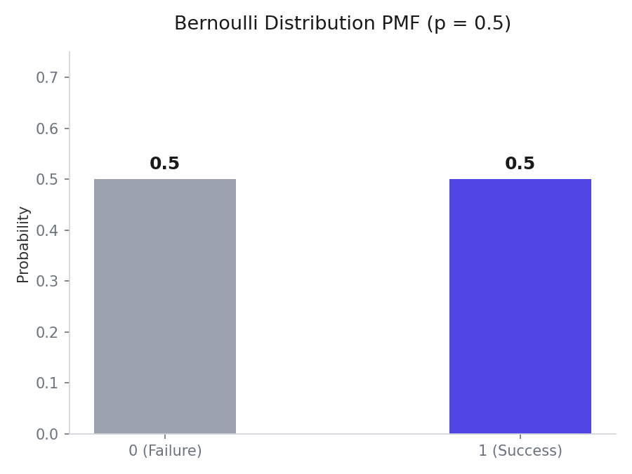
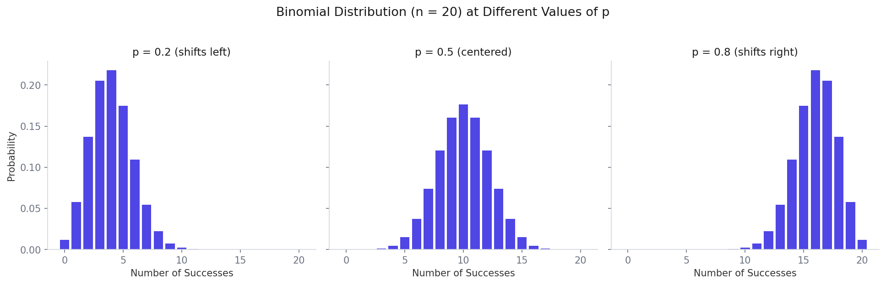
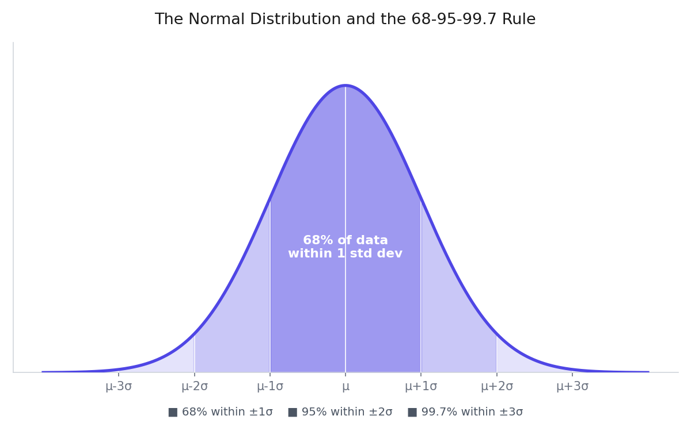
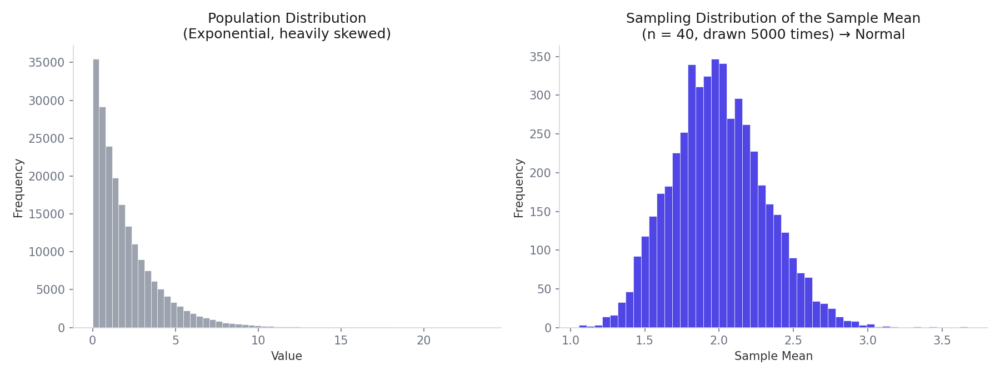
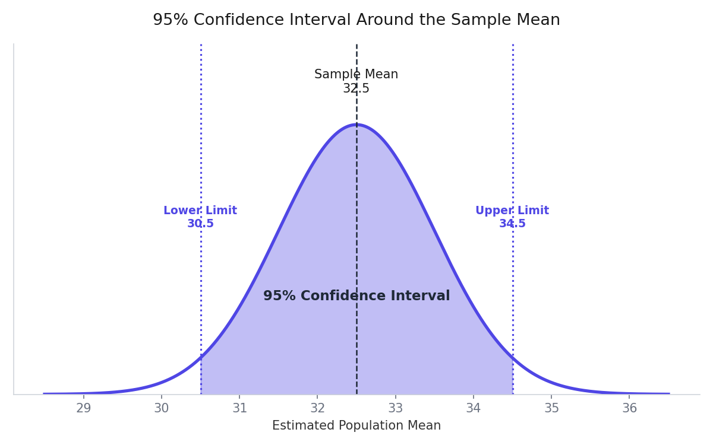

# Understanding the Central Limit Theorem: From Coin Flips to One of the Most Beautiful Results in Statistics

The Central Limit Theorem, usually just called CLT, is one of those topics that sounds intimidating the first time you hear its name, but turns out to be one of the most genuinely satisfying ideas in all of statistics once it actually clicks. Mathematicians consider it one of the most beautiful results in the entire field, and by the end of this note, you will understand exactly why.

This is a long topic, so it helps to know the roadmap before diving in. To properly understand the Central Limit Theorem, you first need two smaller building blocks: the Bernoulli and Binomial distributions, since they give you a concrete feel for what a probability distribution actually is, and the Normal distribution, since that is exactly what the Central Limit Theorem produces. Once those pieces are in place, the theorem itself becomes almost intuitive.

## Building Block 1: The Bernoulli Distribution

### What Is It?

A Bernoulli distribution is a probability distribution that models an outcome with exactly two possibilities, nothing more, nothing less. One outcome is called success, and is represented by the value 1. The other outcome is called failure, and is represented by the value 0.

The distribution is named after the Swiss mathematician Jacob Bernoulli, who introduced it in the late 1600s.

### A Concrete Example

Think about flipping a single coin. There are only two possible outcomes, heads or tails. If you decide that heads counts as success, you assign it the value 1, and tails, as failure, gets the value 0. This single coin flip is a Bernoulli experiment, precisely because it only has two possible outcomes.

Another example: rolling a die and asking whether you get a 5. Here, getting a 5 is success, with a probability of 1/6, and getting anything else, meaning 1, 2, 3, 4, or 6, is failure, with a probability of 5/6.

Any random experiment with exactly two possible outcomes can be modeled as a Bernoulli distribution.

### The Formula

The probability that the random variable X takes a specific value x is written as:

```
P(X = x) = p^x * (1 - p)^(1-x)
```

Here `p` is the probability of success. Plugging in `x = 1` gives you back exactly `p`, the probability of success, and plugging in `x = 0` gives you back `1 - p`, the probability of failure. This single formula elegantly captures both cases at once.

For a fair coin, where `p = 0.5`, this gives P(X=1) = 0.5 and P(X=0) = 0.5, which matches common sense exactly. Plotting this out, the Bernoulli distribution always looks like exactly two bars, one at 0 and one at 1, whose heights add up to exactly 1.



_Bernoulli outcomes show up as probabilities at 0 and 1 (success/failure)._

### Why This Matters in Machine Learning

The Bernoulli distribution shows up constantly the moment you work on any binary classification problem, meaning any problem where the outcome is one of two classes, such as yes or no, spam or not spam, or whether a patient has a certain disease or not. Whenever your target variable only takes two values, you can think of your data as following a Bernoulli distribution. This assumption sits quietly underneath algorithms like Naive Bayes, Logistic Regression, and many others, even if it is never mentioned explicitly.

Honestly, there is not a huge amount more to say about the Bernoulli distribution on its own, since it is intentionally the simplest possible case. Its real value shows up once you extend it into the next distribution.

## Building Block 2: The Binomial Distribution

### The Key Insight: Bernoulli Is Just a Special Case of Binomial

Here is the cleanest way to understand the Binomial distribution: if you understand Binomial, you automatically understand Bernoulli, because Bernoulli is simply what Binomial becomes when you repeat the experiment only once.

The Bernoulli distribution describes performing a single random experiment one time, where that one experiment can either succeed or fail. The Binomial distribution describes repeating that exact same experiment multiple times, and asking how many total successes you got across all those repetitions.

For example, reading one single email and deciding whether it is spam is a Bernoulli experiment. Reading five separate emails and counting how many of them are spam is a Binomial experiment.

### The Two Parameters of a Binomial Distribution

While Bernoulli only needed one parameter, the probability of success `p`, Binomial needs two:

`n`, the number of trials, meaning how many times you repeat the experiment.

`p`, the probability of success on each individual trial.

### A Critical Assumption: Independence

This is the part that is easy to overlook but genuinely important. For an experiment to properly qualify as Binomial, every trial must be independent of every other trial, meaning the outcome of one trial cannot influence the outcome of another.

Imagine asking ten students in a course whether they liked it or not. If the students never talk to each other, each answer is independent, and the whole thing is a valid Binomial experiment. But if the first student tells the second student, "the course was boring, you should say the same," now their answers are related, independence breaks down, and the Binomial distribution no longer applies correctly.

Flipping a coin repeatedly is the classic example of true independence: the result of the first flip has absolutely no influence on the result of the second flip.

### Working Through an Example by Hand

Suppose the probability that someone likes a particular video is 1/2. If three people watch it, what is the probability that none of them like it?

You can reason through this directly without any formula yet. For each of the three people, there are two possible outcomes, like or not like. Across three independent people, there are 2 × 2 × 2 = 8 total equally likely combinations of outcomes. Out of these 8 combinations, exactly one combination has all three people disliking the video. So the probability that none of the three people like it is 1/8.

You could similarly work out the probability that exactly one person likes it, by counting how many of the 8 combinations have exactly one like, and so on. This hand counting approach works fine for small numbers, but clearly becomes painful once you are dealing with something like 10,000 people, which is exactly the kind of situation the Binomial formula is built to handle directly.

### The Binomial Formula

```
P(X = x) = C(n, x) * p^x * (1 - p)^(n - x)
```

Here is what each part means. `C(n, x)`, read as "n choose x", counts the total number of different ways you can arrange exactly x successes among n trials, using combinations from basic combinatorics. `p^x` is the probability of getting successes on exactly those x trials. `(1 - p)^(n - x)` is the probability of getting failures on the remaining trials. Multiplying all three parts together gives you the total probability of getting exactly x successes out of n trials.

Applying it to the example above, wanting exactly 2 successes out of 3 trials with p = 1/2:

```
n = 3, x = 2, p = 0.5

C(3, 2) = 3
P = 3 * (0.5)^2 * (0.5)^1 = 3 * 0.25 * 0.5 = 0.375
```

So there is a 37.5 percent chance that exactly 2 out of 3 people like the video.

### What the Binomial Distribution Looks Like as a Graph

If you plot the probability of every possible number of successes, from 0 up to n, you get a shape that depends entirely on the probability of success, p.

When p is close to 0.5, the graph looks roughly symmetric and centered in the middle, and it actually starts to resemble a bell curve, which is a preview of exactly where this whole note is heading.

When p is pushed higher, closer to 1, the graph shifts noticeably to the right, since higher numbers of successes become more likely.

When p is pushed lower, closer to 0, the graph shifts to the left instead, since lower numbers of successes become more likely.



_Binomial PMFs shift left/right as the success probability p changes._

You can see this directly above: with 20 trials, a low success probability crowds most of the outcomes toward the left, a probability of 0.5 gives a clean, symmetric shape centered in the middle, and a high success probability pushes most outcomes toward the right. Notice that the middle graph, where p = 0.5, already looks suspiciously close to a bell curve. That is not a coincidence, and it is the first hint of where this note is eventually heading.

### Conditions Required for a Valid Binomial Distribution

To summarize everything above into a clean checklist, four conditions need to hold.

The process must consist of a fixed number of trials, n, and there must be more than one trial.

Only two mutually exclusive outcomes are possible on each trial, success and failure.

The probability of success, p, stays fixed and identical across every single trial.

The trials must be independent of one another.

### Why the Binomial Distribution Matters in Machine Learning

You will encounter it constantly in binary classification problems, exactly like Bernoulli, since Binomial is really just the aggregate version of many Bernoulli trials happening together. It shows up in spam detection systems, where the probability of an email being spam or not spam can be modeled using this distribution, and it forms part of the mathematical foundation behind related distributions like Naive Bayes and Multinomial Naive Bayes. It also plays a significant role in hypothesis testing, which uses the Binomial distribution to calculate the probability of observing a certain number of successes in a given number of trials, assuming a particular null hypothesis is true. It even shows up inside logistic regression, through a concept called log odds.

## Building Block 3: The Normal Distribution

Before getting to the Central Limit Theorem itself, it helps to properly understand exactly what shape the theorem produces, and that shape is the Normal distribution, sometimes also called the Gaussian distribution or, more casually, the bell curve.

### What the Normal Distribution Looks Like and Means

The Normal distribution is a continuous probability distribution shaped like a symmetric bell. Most of the data clusters around the middle, and the amount of data gets progressively smaller as you move further away from the center in either direction. Visually, it looks like a smooth hill, with a single peak directly at the center, sloping gently and symmetrically downward on both the left and right sides.

Two numbers completely describe a Normal distribution.

The mean, usually written as the Greek letter mu, tells you exactly where the center peak of the bell sits.

The standard deviation, usually written as the Greek letter sigma, tells you how spread out or squeezed together the bell shape is. A small standard deviation gives you a tall, narrow bell, since most values sit close to the mean. A large standard deviation gives you a short, wide bell, since values are more spread out.

### The 68, 95, 99.7 Rule

This is one of the most practically useful facts about the Normal distribution, and it comes up constantly, including later in this very note when discussing confidence intervals.

Roughly 68 percent of all the data in a Normal distribution falls within one standard deviation of the mean, meaning between mu minus one sigma and mu plus one sigma.

Roughly 95 percent of the data falls within two standard deviations of the mean.

Roughly 99.7 percent of the data falls within three standard deviations of the mean.

For example, imagine test scores across a large class are normally distributed with a mean of 70 and a standard deviation of 10. Roughly 68 percent of students scored between 60 and 80. Roughly 95 percent of students scored between 50 and 90. Almost every student, about 99.7 percent, scored between 40 and 100.



_The Normal bell curve and the 68–95–99.7 rule for standard-deviation bands._

This is exactly what a Normal distribution looks like: a single symmetric peak at the mean, with the shaded regions above showing how much of the data falls within each band of standard deviations on either side. This is precisely how we know what a Normal distribution "looks like": it is not something observed by eye, it is a specific mathematical shape, fully defined by just the mean and standard deviation, and it always produces this exact same symmetric bell profile no matter what real-world quantity it happens to be describing.

This single rule is exactly what will let you compute a confidence interval later in this note, so it is worth remembering clearly.

### Why the Normal Distribution Is So Important

The Normal distribution is everywhere in statistics and machine learning, and one massive reason for that, arguably the single biggest reason, is precisely the Central Limit Theorem you are about to learn. Once you understand the theorem, you will see exactly why the Normal distribution earns its central status in the field, even when the underlying real-world data does not look normal at all.

## Population Versus Sample: A Quick but Necessary Recap

Before getting into sampling distributions, it helps to be crystal clear on two foundational words from statistics.

The population is the entire set of data that exists for whatever you are studying. If you wanted to find the true average salary of every working person in India, the population would be every single working person in the country, potentially over a billion individuals.

A sample is a smaller, randomly selected subset pulled out of that population. Since reaching every single person in a population is almost always impossible in practice, statisticians instead pull out a manageable sample and use it to learn something about the larger population.

Population and sample are foundational precisely because you almost always want information about the whole population, but you almost never have direct access to the whole population, so you have to work backward from a sample instead.

## What Is a Sampling Distribution?

This is the concept that sits directly underneath the Central Limit Theorem, so it deserves careful, patient attention.

### Building the Idea Step by Step

Imagine you have a population, say, the salary of every single person in India. Some people earn 25,000 rupees a month, some earn 100,000, some earn 200,000, and so on. This entire collection of numbers follows some distribution, whatever shape it happens to have.

Now, instead of trying to reach every person in that massive population, you draw a random sample: say, you randomly pick out 50 people and record their salaries. That is one sample of size 50. You calculate the average salary within just this one sample, and you get one number, one sample mean.

Now repeat this entire process, drawing a brand new random sample of 50 different people, and again calculate their average salary. You get a second number, a second sample mean. Repeat this a hundred times total, each time drawing 50 new random people and calculating their average salary.

At the end of this process, you are left with 100 separate numbers, one average for each of your 100 samples. This collection of 100 sample means, considered together, is called the sampling distribution, specifically here the sampling distribution of the sample mean.

### The Formal Definition

A sampling distribution is a probability distribution that describes the statistical properties of a sample statistic, such as the mean or the variance, computed from multiple independent samples of a fixed size drawn from a population.

Breaking this down plainly: you draw samples of a fixed size from a population, you do this multiple times, you calculate some summary statistic, like the mean, for every single sample, and the collection of all those calculated values together forms the sampling distribution. If your summary statistic was the mean, this specific case is called the sampling distribution of the sample mean, which is exactly the version this note focuses on, since it is the version the Central Limit Theorem is built on.

### Why Sampling Distributions Matter

Sampling distributions matter because they let you estimate the variability of a sample statistic, which is genuinely useful for making inferences about the entire population without ever needing to access the entire population directly. By studying the properties of a sampling distribution, you can construct confidence intervals, perform hypothesis testing, and make predictions about a population based purely on sample data. This exact chain of reasoning, starting from sampling distributions and ending in confident statements about an entire population, is precisely what the Central Limit Theorem makes possible.

## The Central Limit Theorem

With Bernoulli, Binomial, the Normal distribution, and sampling distributions all in place, you now have everything needed to properly understand the star of this note.

### The Formal Statement

The Central Limit Theorem states that the distribution of sample means, drawn from a number of independent and identically distributed random variables, will approach a Normal distribution, regardless of the underlying distribution of the original variables.

Read that statement slowly one more time, because the last part is the genuinely surprising bit: **regardless of the underlying distribution**. Whatever shape your original population data has, whether it looks Normal, Uniform, Exponential, Binomial, Gamma, or any other distribution imaginable, or even some strange, messy shape that does not match any known distribution at all, the sampling distribution of the sample mean will still always end up approximately Normal.

### Building the Intuition

Go back to the salary example from the previous section. Suppose the population, meaning the salary of every person in India, follows some completely arbitrary, oddly-shaped distribution, not Normal at all.

Now repeat the exact sampling process described earlier. Draw a random sample of, say, 50 people, calculate the average salary, and record it. Do this many times, say, a thousand times, each time drawing a fresh random sample of 50 people and recording the average.

Once you plot all one thousand of those recorded averages as a histogram, something remarkable happens: that histogram will look like a Normal distribution, a smooth, symmetric bell curve, even though the original salary data you started from was not Normal at all.

This is the exact magic the Central Limit Theorem promises, and it holds no matter what the original population distribution looked like, whether Uniform, Exponential, Binomial, Gamma, or anything else, as long as certain basic conditions, covered shortly, are met.



_CLT: sample means from a skewed population form an approximately Normal distribution._

The chart above shows exactly this in action. On the left is a population following an Exponential distribution, heavily skewed, with a tall spike near zero and a long tail stretching out to the right, nothing at all like a bell curve. On the right is the sampling distribution built by repeatedly drawing samples of 40 values from that same skewed population, averaging each sample, and plotting all of those averages together. Despite starting from a population that looks nothing like Normal, the distribution of sample means comes out looking cleanly Normal regardless.

### Two Additional Precise Results

The theorem tells you more than just "it becomes Normal." It also tells you exactly where that resulting Normal distribution sits and how spread out it is.

If the population has mean `mu` and variance `sigma^2`, then the sampling distribution of the sample mean will itself be Normally distributed with:

Mean equal to `mu`, exactly the same as the population mean.

Variance equal to `sigma^2 / n`, where `n` is the sample size used for each individual sample.

Since standard deviation is just the square root of variance, this means the standard deviation of the sampling distribution, often called the standard error, is:

```
standard error = sigma / sqrt(n)
```

Notice something important here: as your sample size `n` gets larger, this standard error gets smaller, meaning your sample means cluster tighter and tighter around the true population mean. This matches intuition perfectly: drawing bigger samples each time should naturally give you more reliable, less variable averages.

### The Conditions Required for the Theorem to Hold

Three conditions need to be true for the Central Limit Theorem to apply cleanly.

First, the sample size needs to be reasonably large. A commonly cited rule of thumb is that a sample size of 30 or more is generally considered large enough, though this exact threshold can vary depending on how skewed the original population distribution is.

Second, the population needs to have a finite variance. If the underlying distribution has an infinite or undefined variance, an unusual but real mathematical possibility, the theorem breaks down.

Third, the random variables in each sample need to be independent and identically distributed, commonly abbreviated as i.i.d. Independent means the individual values drawn do not influence one another, matching the same independence requirement covered earlier for the Binomial distribution. Identically distributed means every value you draw is coming from the exact same underlying probability distribution, with the same range of possible values and the same probabilities attached to them.

If all three of these conditions hold, the Central Limit Theorem guarantees that the sampling distribution of the sample mean will always be approximately Normal, no matter which specific distribution the original population happens to follow.

## Why the Central Limit Theorem Actually Matters

At this point it is fair to ask: this is a neat mathematical fact, but why should anyone genuinely care about it in practice?

Imagine someone asks you to find the true average salary of every person in India. Reaching all 1.4 billion people directly is obviously impossible. You also have no idea what shape the true underlying salary distribution actually follows, so you cannot simply apply a known formula either.

This is exactly the situation the Central Limit Theorem rescues you from. Here is the practical process it enables.

Draw a random sample from the population, say, 50 people, and record their salaries.

Repeat that process many times, say, 100 times, each time drawing a fresh sample of 50 people.

Calculate the mean for each of those 100 samples, giving you a sampling distribution of the sample mean.

Because of the Central Limit Theorem, you already know, with certainty, that this sampling distribution will be approximately Normal.

Once you know it is Normal, you can calculate its mean and its standard deviation directly from your 100 sample means.

The mean of that Normal sampling distribution gives you your best estimate of the true, unknown population mean. The standard deviation gives you a sense of exactly how much uncertainty is attached to that estimate.

Rather than needing to survey 1.4 billion people, you can get a genuinely solid estimate of the national average salary using something like 50 times 100, which is just 5,000 total data points. That is an enormous, almost unbelievable reduction in effort, and it works for essentially any population you can imagine, whether you are estimating average customer height for a clothing company, average product ratings, or average response times on a website, as long as you can draw reasonably sized random samples repeatedly.

## Turning This Into a Confidence Interval: A Worked Example

Knowing the sampling distribution's mean and standard deviation lets you go one step further than just giving a single estimated number, and instead give a range you are fairly confident contains the true population value. This idea is called a confidence interval, and it will get a full, dedicated note of its own later in this series, but the intuition is worth previewing here, since it uses the Normal distribution facts covered earlier directly.

Suppose you have drawn your samples, calculated your sampling distribution of sample means, and found that this sampling distribution has a mean of 32.5 and a standard error, meaning the standard deviation of the sampling distribution, of roughly 1.

Rather than just saying "the population mean is probably around 32.5," which is called a point estimate and is often not exactly correct, it is far more useful to give a range instead. Recall the 68, 95, 99.7 rule from the Normal distribution section: roughly 95 percent of a Normal distribution's values fall within two standard deviations of its mean.

So, taking two standard errors on either side of your sampling distribution's mean gives you a range you can be roughly 95 percent confident actually contains the true population mean.

```
lower limit = sample_mean - 2 * standard_error
upper limit = sample_mean + 2 * standard_error

lower limit = 32.5 - 2 * 1 = 30.5
upper limit = 32.5 + 2 * 1 = 34.5
```

So instead of claiming the population mean is exactly 32.5, which might be slightly wrong, you can confidently claim the true population mean lies somewhere between 30.5 and 34.5, and you would be right about 95 percent of the time you made a claim like that.



_95% confidence interval around the sample mean using standard errors._

The shaded region in the chart above is exactly that 95 percent confidence interval, sitting within two standard errors on either side of the sample mean. Anything falling inside that shaded band is a plausible location for the true population mean, and anything outside it is considered unlikely enough to reasonably rule out.

Why two standard deviations specifically, rather than one or three? It comes down to a genuine tradeoff. Using only one standard deviation gives you a narrower, more precise-looking range, but your confidence level drops to only around 68 percent, meaning you would be wrong noticeably more often. Using three standard deviations bumps your confidence up to about 99.7 percent, but the resulting range becomes wide enough to be far less practically useful, similar to confidently saying someone's salary is "somewhere between 10,000 and 15,000" versus vaguely saying "somewhere between 5,000 and 20,000." Two standard deviations, giving roughly 95 percent confidence, tends to strike the most commonly used, practical balance between being reasonably precise and being reasonably reliable, which is exactly why 95 percent confidence intervals are the standard default seen throughout statistics.

A more precise version of this same idea uses the multiplier 1.96 instead of exactly 2, since 1.96 is the exact value that corresponds to 95 percent under a standardized Normal distribution, whereas 2 is simply a convenient, commonly used rounding of that same number.

## A Practical Case Study: Estimating Average Ticket Fare From the Titanic Dataset

To make all of this feel less abstract, here is how the entire process looks when actually applied to real, familiar data, using the well known Titanic dataset, which contains a `Fare` column recording how much each passenger paid for their ticket.

Suppose, purely as a learning exercise, you pretend that you do not actually have every single passenger's fare, even though in reality this particular dataset does contain the complete data for all passengers. Treating it as though it were an inaccessible population lets you practice the exact sampling process from scratch.

```python
import pandas as pd
import numpy as np

# combine train and test data to treat it as one large "population"
population = pd.concat([train_df, test_df])
fares = population['Fare'].dropna().tolist()   # convert the Fare column into a plain list

sample_size = 50      # how many passengers to pull out in each individual sample
num_samples = 1000    # how many separate samples to draw in total

sampling_means = []    # this will store one average fare value per sample

for _ in range(num_samples):
    sample = np.random.choice(fares, size=sample_size, replace=True)   # draw one random sample
    sampling_means.append(sample.mean())    # record the average fare of just this sample

sampling_means = np.array(sampling_means)   # convert the list into a NumPy array for easy math
```

At this point, `sampling_means` contains 1,000 separate average fare values, one for each of the 1,000 random samples drawn. Plotting a histogram of `sampling_means` produces exactly what the Central Limit Theorem predicts, a clean, roughly symmetric, bell-shaped Normal distribution, even though the original raw `Fare` column itself is heavily skewed, with most passengers paying relatively low fares and a small number paying extremely high fares.

```python
mean_of_means = sampling_means.mean()          # the average of all 1000 sample means
standard_error = sampling_means.std()           # the standard deviation of the sampling distribution

lower_limit = mean_of_means - 2 * standard_error   # roughly 95% confidence lower bound
upper_limit = mean_of_means + 2 * standard_error   # roughly 95% confidence upper bound

print(mean_of_means, lower_limit, upper_limit)
```

Running this produces a mean fare estimate along with a 95 percent confidence range around it, entirely built from repeated small samples, never once needing to look directly at every single passenger's exact fare value all at once. Comparing this estimated range against the true, actual average fare of the full dataset shows just how remarkably close the two typically are.

The exact same code template, with `Fare` swapped out for any other numeric column, or an entirely different dataset altogether, will let you estimate a population mean and its confidence range for essentially any real-world quantity you might care about, whether that is average customer age, average delivery time, or average product rating.

## A Necessary Companion Idea: The Law of Large Numbers

The Central Limit Theorem is very closely related to another classic, extremely famous result called the Law of Large Numbers, and understanding the difference between the two genuinely sharpens your understanding of both.

### What the Law of Large Numbers Says

The Law of Large Numbers is a simpler, more intuitive statement. It says that as your sample size grows larger and larger, approaching infinity, the sample mean converges directly to the true population mean.

Think about flipping a fair coin. If you flip it just 10 times, you might easily see 7 heads and 3 tails, since with such a small number of flips, randomness can swing the results noticeably away from the expected 50-50 split. But if you flip that same fair coin a million times, the proportion of heads will settle in extremely close to exactly 50 percent. The more times you repeat the experiment, the closer your observed average gets to the true underlying probability.

This directly explains why the Law of Large Numbers gets misunderstood so often, particularly through something called the gambler's fallacy, the mistaken belief that after losing several times in a row, you are somehow "due" for a win to balance things out. In reality, a fair coin has absolutely no memory of its previous flips. The Law of Large Numbers does not work by having early bad luck get specifically corrected later. It works because, given an enormous number of future flips, whatever imbalance happened early on eventually gets completely diluted and swamped out by the sheer overwhelming volume of everything that comes after it.

### How It Differs From the Central Limit Theorem

Here is the key distinction, and it is genuinely worth sitting with for a moment.

The Law of Large Numbers only tells you where the sample mean is heading, namely straight toward the true population mean, as your sample size grows toward infinity. It tells you nothing whatsoever about the shape of the sample mean's distribution along the way, and it tells you nothing about how fast that convergence actually happens.

The Central Limit Theorem, on the other hand, tells you something considerably more detailed and more useful. It tells you the specific shape the sample mean's distribution takes, which is always approximately Normal, and, through the standard error formula covered earlier, it also tells you the precise rate at which that convergence happens, and how spread out your estimate is likely to be at any given, finite sample size.

Put simply, the Law of Large Numbers tells you where you are eventually going. The Central Limit Theorem tells you what the entire journey there actually looks like along the way, which is exactly why it turns out to be the more genuinely useful and more frequently applied theorem in real, practical statistics and machine learning work.

## Applications of the Central Limit Theorem in Data Science and Machine Learning

The Central Limit Theorem is important in statistics and machine learning because it enables making probabilistic inferences about a population based purely on samples. A few concrete examples of exactly where this shows up follow.

Constructing confidence intervals, exactly as demonstrated in the Titanic fare example above, letting you responsibly estimate a population parameter along with a meaningful range of uncertainty around that estimate.

Performing hypothesis testing, a major statistical technique used to test whether an observed effect in data is likely to be genuinely real, or could plausibly just be attributed to random chance. Since hypothesis testing relies heavily on knowing the expected distribution of a sample statistic under some assumption, the Central Limit Theorem provides exactly that.

Making predictions about a population based on sample data, extending naturally from the salary and Titanic fare examples covered throughout this note.

Providing the theoretical justification behind other extremely commonly used statistical techniques, including ANOVA and linear regression, both of which lean on Normal distribution assumptions that ultimately trace their justification directly back to this theorem.

## Final Thoughts

Take a step back for a moment and appreciate exactly what has been shown throughout this note. You can start from literally any population distribution imaginable, Uniform, Exponential, Binomial, Gamma, or something with no clean name at all, repeatedly draw modestly sized random samples, average each of those samples, and the resulting collection of averages will always, reliably, form a clean Normal distribution.

There is genuinely no obvious, simple reason this should be true. It is not the kind of fact you would casually guess sitting down and thinking about probability from scratch, yet it holds with remarkable, mathematically provable reliability, and it is precisely this element of surprise that earns the theorem its reputation as one of the most beautiful results in all of mathematics.

Practically speaking, this single theorem is the reason you never need direct access to an entire population in order to say something meaningful and reasonably confident about it. A relatively small, manageable number of well drawn random samples is genuinely enough. That single fact quietly powers an enormous portion of modern statistics, data science, and machine learning, from something as simple as estimating an average, all the way through to advanced hypothesis testing and the mathematical foundations underneath many commonly used algorithms.
