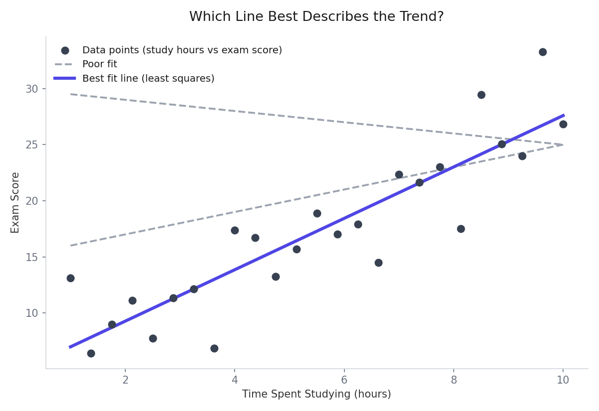
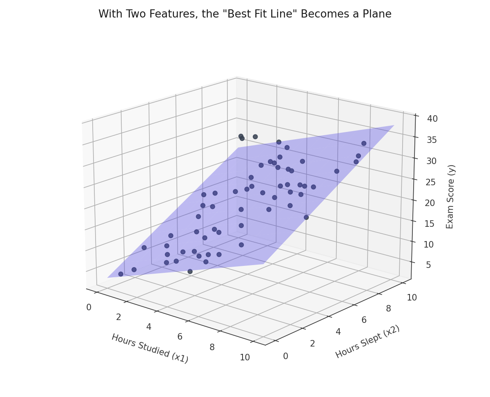
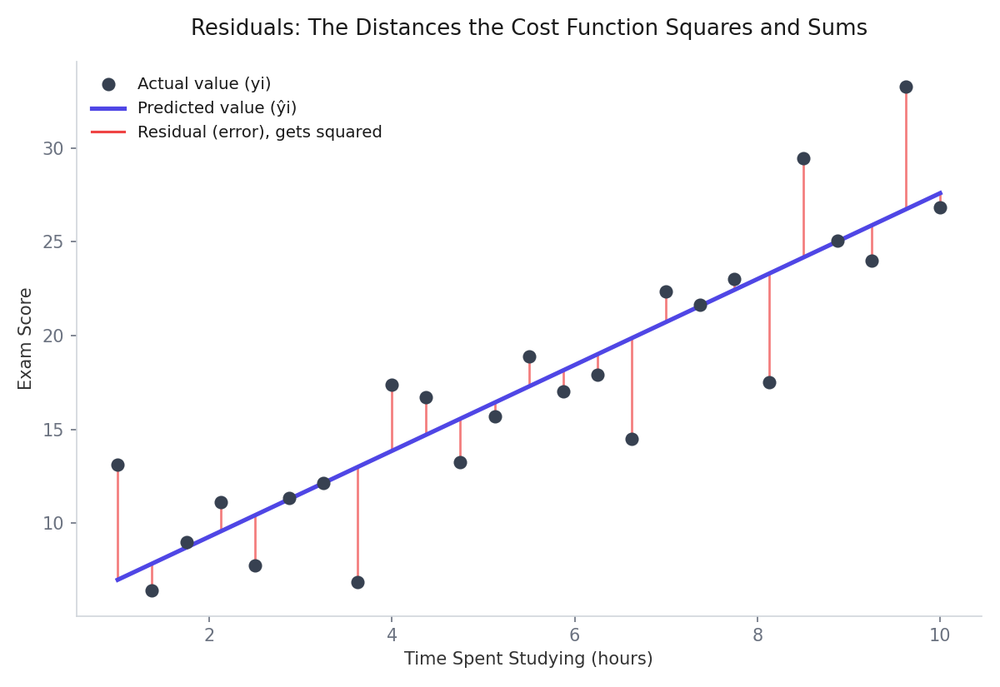
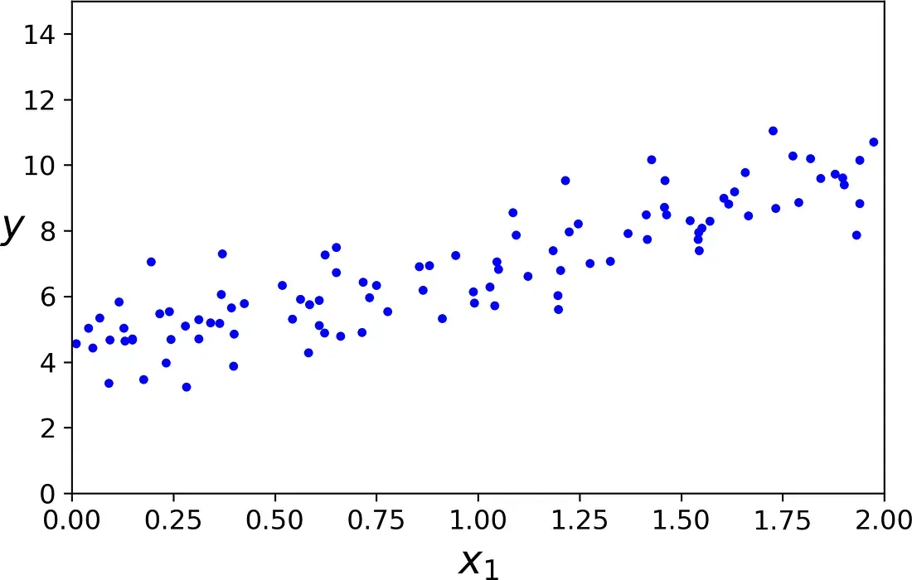
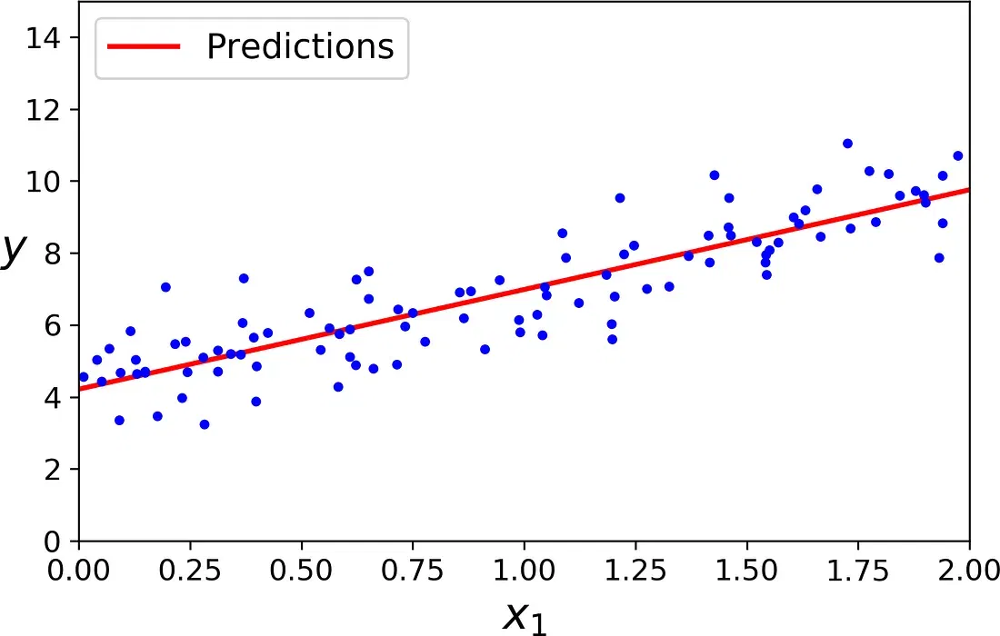
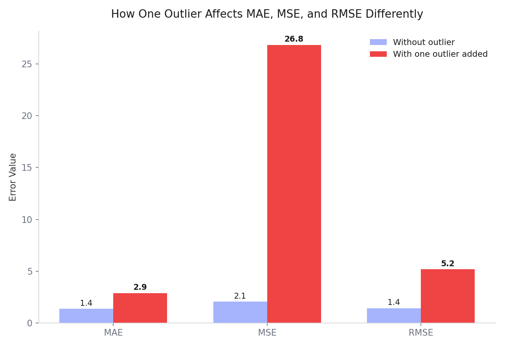
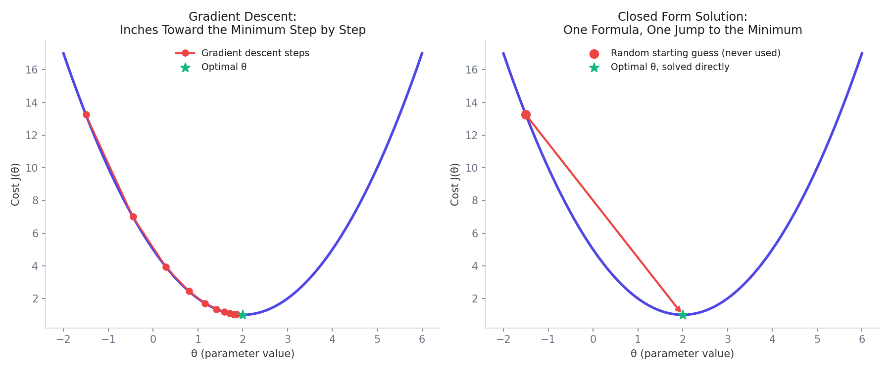

# Linear Regression, Explained Like You're Pricing Insurance for the First Time

how much to charge them. No formula exists yet. Just a spreadsheet with 1,338 past customers and what they were actually charged.



*Which line best describes the trend in the data.*

This is exactly the problem Linear Regression was built to solve, and it is exactly the problem this note walks through, start to finish, using a real Medical Cost dataset with those exact six features (`age`, `sex`, `bmi`, `children`, `smoker`, `region`) predicting one target: `charges`.


By the end, you will understand not just how to run Linear Regression, but exactly what is happening mathematically underneath it, including where its famous formula comes from and how to judge whether your predictions are actually any good.


Picture a simpler example first: time spent studying versus exam score. Plenty of different lines could be drawn through that cloud of points, but most of them clearly miss the trend. The chart above shows two poor attempts in gray, and the actual best fit line, the one Linear Regression solves for mathematically rather than by eye, in solid color. The whole rest of this note is really about how that one best line gets found, precisely, for six features at once instead of just one.

## What Is Linear Regression, Really?

Linear Regression is a supervised learning algorithm used whenever the thing you are trying to predict is a continuous real number, like a price, a temperature, or, in this case, an insurance charge. It works by finding the best fit line, or in higher dimensions, the best fit flat surface, that describes the relationship between your independent variables (age, BMI, and so on) and your dependent variable (charges).

It does this using a principle called Ordinary Least Squares, usually shortened to OLS. The goal of OLS is simple to state: find the line that minimizes the total squared difference between what the model predicts and what actually happened in the data. Squaring the differences matters here, since it treats being 100 dollars too high the same as being 100 dollars too low, and it punishes big mistakes disproportionately more than small ones.

### Why Is It Even Called "Linear"?

This trips up a lot of beginners, so it is worth clearing up early. "Linear" does not mean the real-world relationship being modeled has to look like a straight line when you plot it. It means something narrower and more specific: the prediction is a linear combination of the parameters and the features, meaning you are just adding up weighted contributions, `θ1*x1 + θ2*x2 + ...`, with no feature multiplied by another, no feature raised to a power, nothing more exotic than plain addition and multiplication by a constant.

This distinction matters, because it means Linear Regression can still model curves, just not by bending the model itself. Instead, you can feed it curved features (a topic covered in a separate note on Polynomial Regression). The word "linear" describes how the model combines whatever features it is given, not the shape of the real-world pattern those features happen to represent.

## Setting Up the Problem: The Hypothesis Function

In Linear Regression, each row of your data is called a training example. If you have one independent variable `x` and one dependent variable `y`, a single training example is written as the pair `(xi, yi)`, where the subscript `i` just means "the i-th row." If you have `m` total rows, then `i` runs from 1 up to `m`.

The whole goal of supervised learning is to learn a function, called the hypothesis function, written `h(x)`, that takes an input `x` and estimates the corresponding `y`.

### Simple Linear Regression: One Feature

If you only had one feature, say, just BMI, predicting charges, the hypothesis function would look like this:

```
h(xi) = θ0 + θ1 * xi
```

This is just the equation of a straight line. `θ0` is the intercept, where the line crosses the y-axis, and `θ1` is the slope, how steeply charges increase as BMI increases. `θ0` and `θ1` are called the parameters of the hypothesis, and the entire job of "training" a Linear Regression model is really just finding the specific numeric values of these parameters that fit the data best.

### Multiple Linear Regression: Many Features

Our actual dataset has six independent variables, not one, so we need Multiple Linear Regression instead. Now each training example has several feature values, written `xi1, xi2, ..., xin`, where `j` runs from 1 to `n`, the number of features. The hypothesis function extends naturally:

```
h(xi) = θ0 + θ1*xi1 + θ2*xi2 + ... + θn*xin
```

For our dataset specifically, with `age`, `sex`, `bmi`, `children`, `smoker`, and `region` as the six features, this becomes:

```
h(xi) = θ0 + θ1*age + θ2*sex + θ3*bmi + θ4*children + θ5*smoker + θ6*region
```

Plugging in the very first row of real data, where a 19-year-old female, BMI 27.9, no children, a smoker, from the southwest region, was actually charged 16,884.92:

```
h(x1) = θ0 + θ1*19 + θ2*female + θ3*27.900 + θ4*0 + θ5*yes + θ6*southwest
y1 = 16884.92400
```



*Hyperplane illustration for multiple linear regression.*

The model's whole job is to find values of `θ0` through `θ6` so that `h(x1)` comes out as close as possible to 16,884.92, and simultaneously as close as possible to every other `yi` in the dataset too, all at once. That balancing act across every single row is exactly what the cost function, covered shortly, measures.


This is what happens visually the moment you add a second feature: the single best fit line becomes a flat plane cutting through 3D space, minimizing the vertical distance to every point simultaneously across both features at once. With six features, as in our actual dataset, this same plane becomes a hyperplane, a flat surface in six-dimensional space that cannot be drawn, but works on exactly the same principle as the plane shown above.


## Rewriting Everything as Matrices

Writing out this hypothesis function separately for all 1,338 rows would be unbearable. So instead, everything gets packed into matrices and vectors, which is really just a compact bookkeeping trick, not a new mathematical idea.

Every individual row's features get stacked into one big input matrix `X`, of size `(m, n)`, meaning `m` rows and `n` columns, one row per training example and one column per feature.

The parameters `θ0` through `θn` get stacked into a single column vector `θ`, of size `(n+1, 1)`. The target values `y1` through `ym` get stacked into their own column vector `y`, of size `(m, 1)`.

With everything in this form, the entire hypothesis function for every single row, all at once, collapses into one clean line:

```
h(x) = Xθ
```

That is the entire point of the matrix formulation: instead of writing the hypothesis equation 1,338 separate times, one matrix multiplication does all of it simultaneously. As a quick sanity check on why the shapes work out: matrix multiplication only works when the number of columns in the first matrix matches the number of rows in the second. `X` is `(m, n+1)` and `θ` is `(n+1, 1)`, so multiplying them is valid and produces a result of shape `(m, 1)`, exactly matching `y`. The shapes lining up like this is a good way to sanity check that a matrix equation makes sense before trusting it.

You will also often see the hypothesis written for just a single instance, rather than the whole dataset at once, as `h(x) = θ · x`, using a dot product instead of a full matrix multiplication. This is exactly the same idea, just zoomed in to one row: `θ · x` and one row of `Xθ` compute the identical thing, `θ0*x0 + θ1*x1 + ... + θn*xn`, where `x0` is always 1. Different sources switch between these two notations depending on whether they are talking about one prediction or all of them at once.

## The Cost Function: Measuring How Wrong the Model Is

A cost function measures how much error the model has, in terms of how far off its predictions are from reality. The specific cost function Linear Regression uses is:

```
J(θ) = (1/m) * Σ (h(xi) - yi)²
```



*Residuals illustration showing vertical distances between actual and predicted values.*

In plain words: for every row, take the model's prediction, subtract the actual value, square that difference, then average all those squared differences across every row. This single number, `J(θ)`, tells you exactly how good or bad a particular choice of `θ` is. A perfect model would have `J(θ) = 0`. Training the model means searching for the specific `θ` values that make `J(θ)` as small as possible.


The red lines in the chart above are exactly what the cost function is measuring: the vertical distance between each actual data point and where the line predicts it should be.


You will also often see this same quantity called the RSS, short for Residual Sum of Squares, usually referring to the sum of squared errors without dividing by `m`. `J(θ)` here is just the RSS averaged across all rows, and some textbooks or tutorials use `θ` for the parameter vector while others use `β` (beta) instead. Both refer to the exact same thing: the vector of parameters the model is trying to solve for.

One more thing worth clearing up: the most commonly quoted performance measure for regression is actually RMSE (covered in full later in this note), not MSE. So why does this note, and most derivations like it, minimize MSE instead? Because minimizing MSE and minimizing RMSE always lands on the exact same `θ`. RMSE is just the square root of MSE, and square root is a monotonically increasing function, meaning whichever `θ` makes MSE smallest also makes RMSE smallest. MSE is simply the mathematically cleaner one to differentiate, with no square root getting in the way of the calculus, which is exactly why it shows up in the derivation ahead instead of RMSE directly.

To make the matrix version of this cost function work out cleanly, one small trick gets added: an extra column of all 1s gets bolted onto the front of `X`, corresponding to `θ0`, the intercept term. This turns `X` into a matrix of shape `(m, n+1)` instead of `(m, n)`. With that adjustment, the cost function can be written entirely in matrix form:

```
J(θ) = (1/m) * (Xθ - y)ᵀ * (Xθ - y)
```

This is exactly the same calculation as before, just expressed as one matrix expression instead of a summation. `(Xθ - y)` is a column vector of every row's individual error. Multiplying it by its own transpose is a compact way of squaring every entry and adding them all together in a single step.

## The Normal Equation: Solving for the Best θ Directly

Here is where Linear Regression gets genuinely elegant. Rather than guessing and slowly adjusting `θ` bit by bit, it turns out you can solve directly, using calculus, for the exact `θ` that minimizes `J(θ)` in one shot. This direct solution is called the Normal Equation.

The idea from calculus is simple: at the lowest point of a curve, its slope is exactly zero. So, to find the `θ` that minimizes the cost function, take the derivative of `J(θ)` with respect to `θ`, and set it equal to zero.

```
∂J(θ)/∂θ = 0
```

Here is the derivation, one step at a time, dropping the constant `1/m` upfront since it does not affect where the minimum sits.

Start by expanding `J(θ) = (Xθ - y)ᵀ(Xθ - y)` using ordinary algebra:

```
J(θ) = θᵀXᵀXθ - 2θᵀXᵀy + yᵀy
```

(The middle terms combine into one because `yᵀXθ` and `θᵀXᵀy` are transposes of each other, and since both are just single numbers, a 1x1 matrix, a number always equals its own transpose, so the two terms are identical and can be combined.)

Now take the derivative of each piece with respect to `θ`, using two basic calculus facts: the derivative of `θᵀAθ` with respect to `θ` is `2Aθ` when `A` is symmetric (and `XᵀX` always is), and the derivative of a constant, like `yᵀy`, is simply 0.

```
∂J(θ)/∂θ = 2XᵀXθ - 2Xᵀy + 0
```

Setting this equal to zero, exactly as the calculus rule for a minimum requires:

```
0 = 2XᵀXθ - 2Xᵀy
XᵀXθ = Xᵀy
```

And finally, solving for `θ` by multiplying both sides by the inverse of `XᵀX`:

```
θ = (XᵀX)⁻¹ Xᵀy
```

This is the Normal Equation. Plug in your actual `X` matrix and `y` vector from the dataset, and this formula spits out the exact optimal values for every single `θ`, all at once, with no guessing, no trial and error, and no iteration required. It is a direct, analytical solution, which is exactly why it is considered one of the most elegant results in introductory machine learning.

### A Quick Sanity Check With Simple Data

Before applying this to all six insurance features at once, it helps to see the Normal Equation work on the simplest possible case first: one feature, a known true relationship, and just two lines of code.

```python
import numpy as np

X = 2 * np.random.rand(100, 1)
y = 4 + 3 * X + np.random.randn(100, 1)
```



*Scatter plot of the simple generated data.*

This data was deliberately generated from `y = 4 + 3x + noise`, so the true `θ0` is 4 and the true `θ1` is 3. Knowing the right answer in advance makes it easy to check whether the formula actually works.


Plotted, it looks exactly like what you would expect: a rough upward trend buried under random noise, with no way to know the exact underlying line just by eye.


```python
X_b = np.c_[np.ones((100, 1)), X]   # add the x0 = 1 column for the intercept
theta_best = np.linalg.inv(X_b.T.dot(X_b)).dot(X_b.T).dot(y)   # the Normal Equation, directly
print(theta_best)
```

```
[[4.21509616]
 [2.77011339]]
```



*Line fitted by the Normal Equation overlaid on the data.*

The formula recovers `θ0 ≈ 4.215` and `θ1 ≈ 2.770`, close to the true 4 and 3, but not exact, purely because of the random noise mixed into the data. There is no way to perfectly undo noise that was never real signal in the first place, so landing close, rather than exact, is the expected and correct outcome here.


Plotting this fitted line directly on top of the data shows it running right through the middle of the cloud of points, exactly where a best fit line should sit.


## Fitting a Quick Visual: Charges vs BMI

Before judging any model numerically, it always helps to see the relationship visually first. Plotting just BMI against charges, ignoring the other five features for a moment, and fitting a regression line through it:

```python
sns.lmplot(x='bmi', y='charges', data=df, aspect=2, height=6)
plt.xlabel('Body Mass Index (kg/m²): Independent variable')
plt.ylabel('Insurance Charges: Dependent variable')
plt.title('Charges vs BMI')
```

This produces a scatter plot of every customer's BMI against their charges, with a single straight line drawn through the cloud of points, exactly the kind of best fit line the Normal Equation calculates directly, just restricted here to one feature so it can actually be drawn on a 2D chart.

## Making Sense of a Trained Model

Once `θ` has actually been solved for, whether by the Normal Equation or by gradient descent, the resulting numbers are not just abstract outputs. They are directly readable, which is one of Linear Regression's biggest practical strengths.

### Interpreting the Coefficients

Each coefficient `θj` tells you how much the prediction changes when that one feature increases by exactly one unit, while every other feature is held constant. If `θ_bmi` came out to roughly 393, that means, holding age, sex, children, smoking status, and region all fixed, each additional point of BMI is associated with about 393 dollars more in predicted insurance charges.

That "holding everything else constant" part matters enormously, and is the single most common thing people get wrong when reading coefficients. A coefficient never describes what happens in the real world in isolation, only what the model estimates while every other feature stays frozen. Coefficients are also easiest to trust when the features feeding into them are meaningful, reasonably clean, and not too strongly correlated with each other. If two features overlap heavily, say, including both a person's age and their number of years since starting their first job, the model can struggle to cleanly separate which one is really driving the prediction, and the resulting coefficients can become unstable or misleading, even if the overall predictions still look reasonable.

### What the Intercept Actually Means

The intercept, `θ0`, is the model's predicted value when every single feature is set to zero. Sometimes that has a genuinely sensible real-world meaning. Often, it does not. A hypothetical customer with age 0, BMI 0, and every other feature at 0 does not correspond to any real person, so the intercept here should not be read as "the base cost of insuring a newborn with no body mass." Mathematically, though, the intercept still matters a great deal: it anchors the entire line or plane in place, and without it, the model would be forced to pass directly through the origin, which would usually fit the data far worse. Even when its value is not directly interpretable, it should not be ignored.

## The Assumptions Behind Linear Regression

Linear Regression is not just a formula you can point at any dataset. It quietly assumes several things about the data are true, and the more of these assumptions get violated, the less trustworthy its coefficients and predictions become.

**Linearity.** The relationship between the features and the target should be approximately linear. This does not require a perfect straight line in reality, but the model should not be forced onto data that is fundamentally curved, threshold-based, or otherwise structured in a way a straight line genuinely cannot approximate.

**Independence of observations.** Each row should be reasonably independent of the others. If rows are heavily related, for instance repeated measurements from the same customer over time, treated as if they were separate, unrelated customers, the model can end up overstating how much it has actually learned.

**Homoscedasticity.** This intimidating word simply means the spread of the errors should stay roughly consistent across the whole range of predictions. If the model's errors are small for low-charge customers but huge and wildly variable for high-charge customers, that uneven spread is a sign the model is missing something systematic about how the data behaves.

**Low multicollinearity.** The input features should not be too strongly correlated with each other. Including both a person's height in centimeters and the exact same height in inches would be an extreme example, since those two columns carry almost identical information, which can make the individual coefficients unstable and much harder to interpret confidently.

**Approximately normal residuals.** The leftover errors, the residuals covered earlier in the cost function section, should roughly follow a Normal distribution. This assumption matters less for raw prediction accuracy and more for statistical inference, things like confidence intervals around the coefficients themselves, a topic covered in detail in a separate note in this series.

None of these assumptions need to hold perfectly. Real data rarely cooperates that cleanly. But the more of them are seriously violated, the more skeptical you should be of trusting the model's coefficients as a genuine explanation of the underlying pattern, even if its raw predictions still look reasonably accurate.

## Why Evaluate on Data the Model Has Never Seen

Before getting into the evaluation metrics themselves, one habit matters more than any single formula: never judge a model purely on how well it fits the data it was trained on.

A model that has already seen every answer can look deceptively good simply by memorizing quirks specific to that particular dataset, without having learned anything that generalizes to new customers it has never encountered. This is exactly why real projects split their data into a training set, used to solve for `θ`, and a separate test set, deliberately held back and never touched during training, used purely to check how well the model performs on genuinely unseen data. A model that fits the training data closely but performs noticeably worse on the test set is a common, important warning sign, and it is exactly the kind of gap the metrics below are meant to catch, provided you actually compute them on held-out data rather than the same rows the model already learned from.

## How Do You Know If the Model Is Any Good? Evaluation Metrics

Once the model produces predictions, you need a way to judge how close those predictions are to reality. Four metrics come up constantly for this, and each one tells a slightly different part of the story.

### Mean Absolute Error (MAE)

```
MAE = (1/N) * Σ |yi - ŷi|
```

MAE is the average of the absolute difference between the actual value `yi` and the predicted value `ŷi`. Taking the absolute value matters here: without it, a prediction that's 500 too high and another that's 500 too low would cancel each other out to zero on averaging, hiding the fact that the model was wrong both times. An MAE of 0 means perfect predictions every time; the larger the MAE, the worse the model.

MAE is measured in the same units as the original data (dollars, in our case), which makes it easy to interpret directly. It is also robust to outliers, meaning a single wildly-off prediction does not distort it too much, since errors are not squared, just averaged directly. The tradeoff is that MAE is not differentiable at zero, which becomes relevant if you were training a model using calculus-based optimizers like gradient descent instead of the direct Normal Equation used here.

### Mean Squared Error (MSE)

```
MSE = (1/N) * Σ (yi - ŷi)²
```

This is exactly the same calculation used inside the cost function `J(θ)` above. MSE squares every error before averaging, which has two effects: it removes the issue of positive and negative errors canceling out, and it punishes large errors disproportionately harder than small ones, since squaring a big number grows much faster than squaring a small one. This means MSE is quite sensitive to outliers, a single very bad prediction can inflate it substantially, which is the opposite tradeoff from MAE. Lower MSE always means a better fitting model.

### Root Mean Squared Error (RMSE)

```
RMSE = √MSE = √[(1/N) * Σ (yi - ŷi)²]
```

RMSE simply takes the square root of MSE. Why bother? Because MSE's units are squared, dollars squared, in our case, which is not something you can intuitively interpret. Taking the square root brings the error back into the original, interpretable unit (plain dollars), while still keeping MSE's characteristic of penalizing large errors heavily. Lower RMSE means better predictions, and a noticeably higher RMSE than MAE on the same model is usually a sign that some predictions are wildly off, since RMSE reacts so strongly to large individual errors.



*Outlier sensitivity comparison for MAE, MSE, and RMSE.*


The chart above makes the difference concrete.


### R² Score (Coefficient of Determination)


```
R² = 1 - [Σ(yi - ŷi)² / Σ(yi - ȳ)²]
```

Here `ȳ` (read "y-bar") is simply the mean of all the actual `y` values. R² answers a different question than the previous three metrics: instead of measuring raw error size, it measures how much better your model is compared to just guessing the average every time.

The denominator, `Σ(yi - ȳ)²`, represents the total variation in the data if you made no effort at all and just predicted the average charge for everyone. The numerator represents the actual leftover error your model still has. R² typically ranges from 0 to 1: an R² of 1 means your model explains all the variation in the data perfectly. An R² of 0 means your model is doing no better than just guessing the average every single time. A negative R² is actually possible too, and it signals something has gone genuinely wrong, since it means your model is performing worse than that trivial "just guess the average" baseline.

## A Wider Lens: MAE and RMSE Are Both "Norms"

MAE and RMSE can feel like two unrelated formulas that just happen to both measure error. They are actually two specific cases of one more general mathematical idea, called a norm, which measures the "distance" between two vectors, in this case, the vector of predictions and the vector of actual values.

Computing the square root of a sum of squares, exactly what RMSE does, is called the L2 norm, or Euclidean norm, the same everyday notion of straight-line distance you already know from geometry. When this same idea is applied to matrices instead of vectors, it goes by another name, the Frobenius norm, but it is the identical calculation.

Computing a plain sum of absolute values, exactly what MAE does, is called the L1 norm, sometimes nicknamed the Manhattan norm, since it resembles measuring distance in a city where you can only travel along a grid of streets, never diagonally.

Both are actually special cases of a more general formula, the Lp norm of a vector with n elements:

```
||v||p = (Σ |vi|^p) ^ (1/p)
```

Setting `p = 1` gives you the L1 norm, MAE's foundation. Setting `p = 2` gives you the L2 norm, RMSE's foundation. Two more values of `p` show up occasionally and are worth knowing by name: the L0 "norm" simply counts how many entries in the vector are non-zero, and the L∞ norm just returns the single largest absolute value in the vector, ignoring everything else entirely.

The general pattern worth remembering: the higher the value of `p`, the more that norm gets dominated by the largest values in the vector, and the more it effectively ignores the smaller ones. This is exactly why RMSE reacts so much more strongly to outliers than MAE does, precisely as shown in the outlier chart earlier in this note. It is not a coincidental design choice, it falls directly out of squaring being a higher-order operation than taking a plain absolute value. When outliers are genuinely rare, following something close to a bell-shaped distribution, RMSE tends to be the better default choice. When outliers are common or especially extreme, MAE's steadier, less reactive behavior is often preferred instead.

## Bringing It All Together

Step back and look at the full journey this note just walked through. You started with a completely relatable, concrete problem: pricing insurance based on six pieces of information about a person. You expressed that problem as a hypothesis function, first for one feature, then generalized to all six. You packed that hypothesis into clean matrix notation so it could describe all 1,338 rows simultaneously with a single equation, `h(x) = Xθ`. You defined a cost function, `J(θ)`, to measure exactly how wrong any particular choice of parameters is. You then used basic calculus, setting the derivative of that cost function to zero, to derive the Normal Equation, `θ = (XᵀX)⁻¹Xᵀy`, a direct formula that hands you the best possible parameters in one step. And finally, you learned four different lenses, MAE, MSE, RMSE, and R², for judging whether the resulting model's predictions are actually trustworthy.

That is the complete arc of classical Linear Regression, from a plain English problem statement all the way through to a mathematically justified solution and a way to grade its own performance. Every other regression technique you learn from here, regularized regression, polynomial regression, even parts of neural networks, builds directly on top of this exact same foundation.

## Strengths, Weaknesses, and Where This Actually Gets Used

With the full mechanics now covered, it is worth stepping back and being honest about when Linear Regression is genuinely the right tool, and when it is not.

**Strengths.** It is transparent: every coefficient can be inspected and explained directly, exactly as covered above, which matters enormously in fields like finance, healthcare, and operations, where people need to understand why a model made a particular prediction, not just trust a black box. It is fast to train, especially compared to more complex models, since the Normal Equation alone can solve small to medium problems in one direct step. It also makes an excellent baseline: before reaching for a random forest, a gradient boosted model, or a neural network, fitting a Linear Regression first tells you how much signal a simple model can already capture, which any more complex model then has to meaningfully beat to justify its added complexity.

**Weaknesses.** It struggles badly with relationships that are genuinely non-linear, curved, or driven by strong interactions between features, unless you deliberately engineer curved or interaction features into it yourself. It is sensitive to outliers, since a small number of extreme points can noticeably pull the fitted line or plane away from where the bulk of the data actually sits, an effect made worse by the squared error at the heart of OLS. It rests on the assumptions covered above, and can become unstable or misleading when those assumptions are badly violated, particularly high multicollinearity between features.

**Where it shows up in practice.** Despite, or perhaps because of, its simplicity, Linear Regression remains genuinely widely used: demand forecasting, pricing models, risk estimation, cost prediction, trend analysis, and marketing performance estimation all lean on it regularly, sometimes as the actual production model, and very often as the baseline every fancier model gets compared against.

## Building Linear Regression From Scratch in Python, No Library Doing the Math for You

Everything above has been leading to one thing: actually writing code that computes `θ = (XᵀX)⁻¹Xᵀy` directly, with no gradient descent, no iteration, no guessing. This is called the closed form solution, since it is a direct, algebraic formula rather than something you approach step by step. To prove it genuinely works, and not just in theory, the code below is tested against `LinearRegression` from scikit-learn afterward, and both should produce the exact same result.

### Writing the Class

```python
import numpy as np

class LinearRegressionClosed:
    def __init__(self):
        # these get learned during fit(), so they start out empty
        self.coef_ = None       # this will hold theta1 ... thetan (the slopes)
        self.intercept_ = 0.0    # this will hold theta0 (the bias/intercept)

    def fit(self, X, y):
        X = np.array(X)
        y = np.array(y)

        # prepend a column of 1s to X, exactly the x0 = 1 trick from the
        # hypothesis function section earlier in this note. This lets the
        # intercept theta0 get solved for using the same single formula,
        # instead of handling it as a separate special case.
        ones_column = np.ones((X.shape[0], 1))
        Xb = np.concatenate([ones_column, X], axis=1)

        # this one line IS the Normal Equation derived earlier:
        # theta = (X^T X)^-1 X^T y
        beta = np.linalg.inv(Xb.T.dot(Xb)).dot(Xb.T).dot(y)

        self.intercept_ = beta[0]    # the first value is theta0
        self.coef_ = beta[1:]         # everything after that is theta1...thetan

    def predict(self, X):
        X = np.array(X)
        # h(x) = X*theta, written here as a dot product plus the intercept
        return X.dot(self.coef_) + self.intercept_
```

Notice how directly this maps back to the math from earlier in this note. The `fit` method is nothing more than the Normal Equation, `θ = (XᵀX)⁻¹Xᵀy`, translated line by line into NumPy: `np.linalg.inv(...)` for the matrix inverse, `.dot(...)` for matrix multiplication, and `.T` for the transpose. The `predict` method is just `h(x) = Xθ`, the hypothesis function, applied using the coefficients that `fit` just solved for.

### Testing It Against a Real Dataset

To confirm this actually works, and not just for our own custom insurance data, here it is applied to the California Housing dataset, and compared directly against scikit-learn's own, professionally implemented `LinearRegression`.

```python
from sklearn.datasets import fetch_california_housing
from sklearn.metrics import r2_score
from sklearn.linear_model import LinearRegression

# load a real dataset: predicting median house value from housing features
X, y = fetch_california_housing(return_X_y=True)

# fit and predict using OUR from-scratch implementation
reg = LinearRegressionClosed()
reg.fit(X, y)
y_pred = reg.predict(X)
print("Our from-scratch R2 score:", r2_score(y, y_pred))

# fit and predict using scikit-learn's implementation, for comparison
reg_sk = LinearRegression()
reg_sk.fit(X, y)
y_pred_sk = reg_sk.predict(X)
print("scikit-learn R2 score:", r2_score(y, y_pred_sk))
```

```
Our from-scratch R2 score: 0.6062326851998051
scikit-learn R2 score: 0.6062326851998051
```

There is no hidden trick scikit-learn is using instead. It is this same formula, just written by people who have also handled the extra engineering details, like numerical stability for very large datasets, that a from-scratch version like this one does not worry about.

### Why This Version Doesn't Use Gradient Descent

It is worth being explicit about what makes this approach different from the more commonly taught gradient descent version of Linear Regression.



*Gradient descent vs the closed form solution.*


The chart above shows this difference directly on a simple cost curve.


The tradeoff, not covered in depth in this note but worth knowing, is that computing a matrix inverse, `(XᵀX)⁻¹`, becomes computationally expensive once you have a very large number of features, which is exactly the kind of situation where gradient descent, despite needing many iterations, ends up being the more practical choice instead.