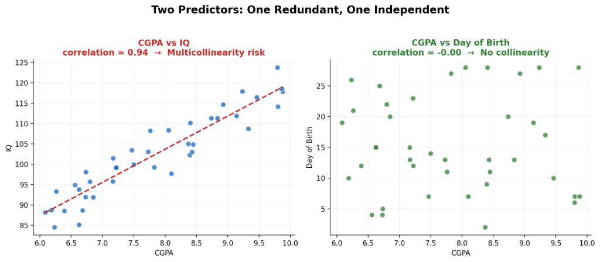
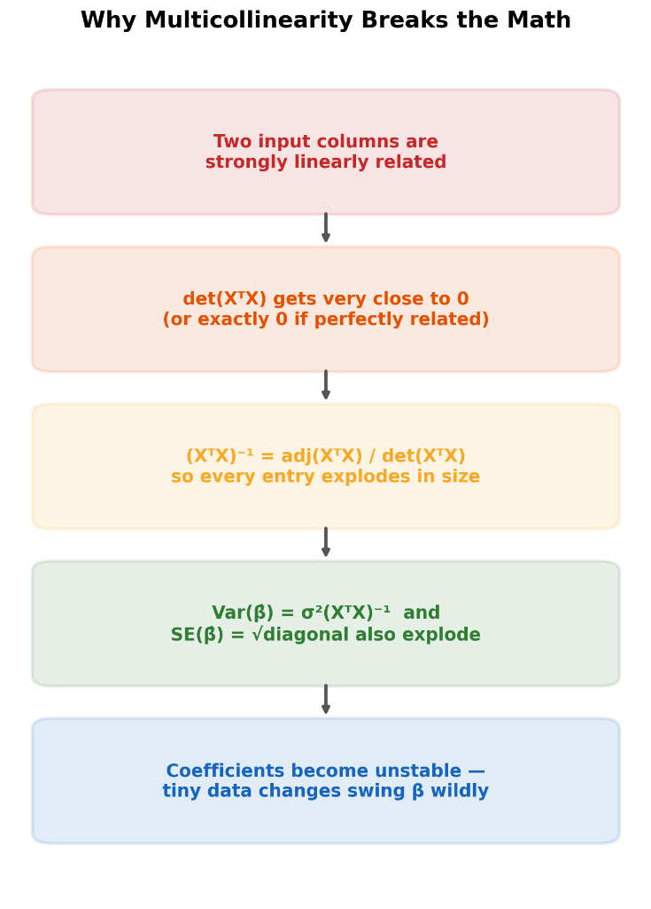
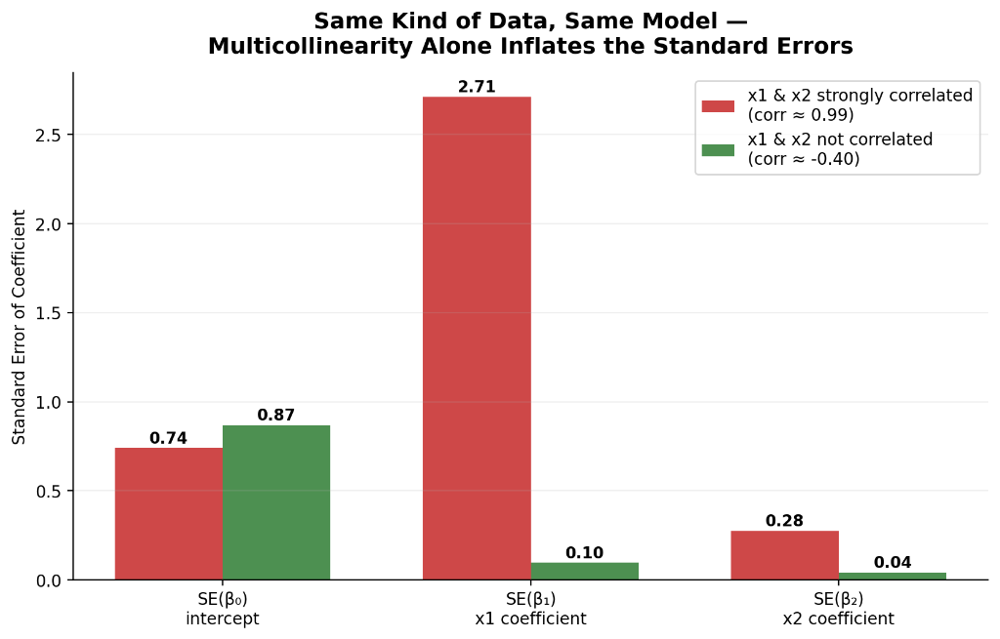
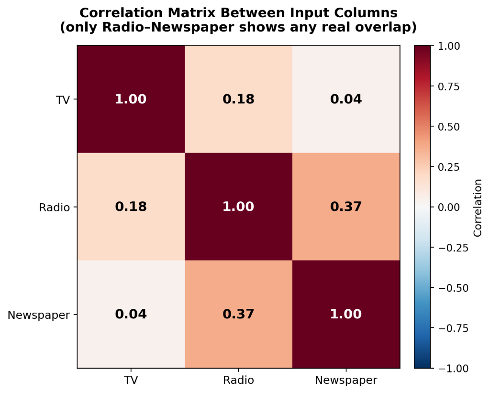

# Multicollinearity, Explained Simply (With Real Numbers, Not Just Theory)

*Why two "different" columns in your data can secretly be saying the same thing*

---

If you've ever run a regression and gotten a coefficient that made no sense, a huge negative number where you expected something small and positive, multicollinearity is very often the reason. It's also one of the most commonly asked concepts in ML and data science interviews. Here's the whole idea, built up from scratch with real, verified numbers at every step.

## What is multicollinearity?

Multicollinearity is a statistics phenomenon where two or more independent variables (predictor columns) in a regression model are highly correlated with each other. In plain words: two columns in your data that are supposedly separate are actually carrying a lot of the same information.

A few examples make this click immediately:

**High multicollinearity:** Say you're predicting a student's placement package (`lpa`) using their CGPA and their IQ. In most real cohorts, students with a higher IQ also tend to have a higher CGPA. These two columns move together, so they're redundant to some degree, and that's multicollinearity.

**Also high multicollinearity (inverse relationship):** CGPA and number of backlogs. Generally, a higher CGPA goes with fewer backlogs. It's a negative relationship rather than positive, but it's still a strong linear relationship, and multicollinearity doesn't care about the direction, only the strength.

**No multicollinearity:** CGPA and date of birth. There's no real reason these two would move together at all.



*Two predictors: One redundant (high correlation with target and other predictor), one independent.*

The formal definition: multicollinearity is a statistical phenomenon where two or more independent variables in a multiple regression model are highly correlated, making it difficult to isolate the individual effect of each predictor on the dependent variable.

## Why does this actually matter? Inference vs. Prediction

This is the single most important distinction in this whole topic, and it's usually where people get confused. Machine learning and statistics use models for two different jobs:

**Prediction** means you only care about the final output being accurate. You feed in a new student's CGPA and IQ, and you just want a good guess at their package. You don't care why the model arrived at that number.

**Inference** means you care about understanding the relationship itself. You want to know, specifically, how much does increasing IQ by one point change the package, while holding CGPA fixed? A bank deciding loan approvals doesn't just want a yes/no, it wants to know which factors are actually driving that decision, since that has legal and business implications. A model that flags and bans suspicious website users needs to know which specific behaviors triggered the flag, not just get a correct ban/no-ban rate.

Here's the key insight: **multicollinearity is a serious problem for inference, but barely a problem for prediction.**

Why doesn't it hurt prediction? Because even if CGPA and IQ are tangled together, the model can still combine them into one blended signal and predict the output just fine, it's just that you can no longer cleanly say how much of that signal came from CGPA alone versus IQ alone. This can actually be shown mathematically: if $X_1$ is a near-perfect linear function of $X_2$ (say $X_1 = a_0 + a_1 X_2 + \text{small noise}$), substituting that into the true model $Y = \beta_0 + \beta_1 X_1 + \beta_2 X_2 + \text{error}$ collapses down to $Y = C_0 + C_1 X_2 + \text{noise}$, a perfectly valid model that still predicts $Y$ accurately using $X_2$ alone. What's lost is the ability to cleanly separate $\beta_1$ from $\beta_2$, not the ability to predict $Y$.

Why does it wreck inference? Because now you genuinely cannot answer "holding CGPA constant, what's the effect of IQ," since CGPA never actually stays constant when IQ changes, they move together in your real data. The assumption inference relies on, changing one input while holding the rest fixed, simply breaks down.

| | Inference (understanding "why") | Prediction (estimating "what") |
|---|---|---|
| **Goal** | Understand the relationship between inputs and output | Get an accurate forecast on new data |
| **Cares about** | Whether each coefficient is reliable and interpretable | Overall accuracy, error minimized |
| **Multicollinearity's impact** | Extremely harmful, coefficients become meaningless | Not much impact, predictions stay just as accurate |

## What's actually happening, mathematically

Recall how linear regression finds its coefficients using Ordinary Least Squares (OLS):

$$\hat{\beta} = (X^T X)^{-1} X^T Y$$

Every coefficient's reliability comes from this formula, and specifically from being able to invert the matrix $X^T X$. The standard error of each coefficient, how much that estimate would bounce around if you resampled your data, comes from:

$$\text{Var}(\hat{\beta}) = \sigma^2 (X^T X)^{-1}$$

$$\text{SE}(\hat{\beta}) = \sqrt{\text{diagonal elements of } \text{Var}(\hat{\beta})}$$

Here's where multicollinearity strikes. To compute any matrix inverse, you need its determinant, since $(X^T X)^{-1} = \frac{\text{adj}(X^T X)}{\det(X^T X)}$. If two columns of your data are strongly linearly related, $\det(X^T X)$ shrinks toward zero. And dividing by a number close to zero makes everything explode.



*Why multicollinearity breaks the mathematical stability of OLS regression.*

This gives you the three classic symptoms of multicollinearity, all stemming from the exact same root cause:

1. **Difficulty identifying important predictors** — you genuinely can't tell which input is driving the output.
2. **Inflated standard errors** — the $\text{SE}(\beta)$ values become huge, meaning the model has very low confidence in each coefficient's exact value.
3. **Unstable, sensitive estimates** — a tiny change in your training data causes a wildly different set of coefficients.

## A worked example: perfect multicollinearity

Let's actually see this break. Say `percentage` in your dataset is always exactly 10 times `cgpa` (a very common real-world mistake, someone accidentally including two versions of the same measurement).

| Student | Intercept | CGPA | Percentage (=10×CGPA) | LPA |
|---|---|---|---|---|
| 1 | 1 | 8 | 80 | 3 |
| 2 | 1 | 6 | 60 | 4 |
| 3 | 1 | 7 | 70 | 5 |
| 4 | 1 | 9 | 90 | 6 |

Building the design matrix $X$ and computing $X^T X$ gives:

```
XᵀX = [   4      30     300  ]
      [  30     230    2300  ]
      [ 300    2300   23000  ]
```

Computing the determinant of this matrix gives **exactly 0**. Column 3 is just 10 times column 2, a perfect linear dependency, so the matrix is singular. Trying to invert it in code throws exactly the error you'd expect:

```python
import numpy as np

XtX = np.array([
    [4, 30, 300],
    [30, 230, 2300],
    [300, 2300, 23000]
])

print("det(XtX):", np.linalg.det(XtX))  # returns 0.0
np.linalg.inv(XtX)                     # raises: LinAlgError: Singular matrix
```

No inverse exists, which means $\beta$ can't be computed at all. This is the extreme case, **perfect multicollinearity**, where one column is an exact linear function of the others. Once you drop the redundant column, the problem disappears entirely, since there was never any real reason to have it in the first place.

## What happens with everyday, imperfect multicollinearity

Perfect collinearity is rare in practice. What you'll actually run into constantly is **strong, but not perfect**, collinearity, two columns that are related but with a bit of natural noise. This doesn't make the matrix un-invertible, but it does make it nearly singular, which is just as damaging in practice.

Here's a real test: I built two small datasets with the exact same underlying relationship, one where the two inputs are almost perfectly correlated (0.99), and one where they're barely related (-0.40). Same model, same true relationship, just different correlation between the inputs.



*Multicollinearity alone inflates the standard errors of regression coefficients by orders of magnitude.*

Look at that middle bar. The coefficient for $x_1$ has a standard error of **2.71** in the collinear dataset versus just **0.10** in the clean one, roughly 28 times larger, purely because of how related the two input columns are, nothing else changed. On top of that, when I nudged just one single data point's $x_1$ value by a tiny 0.05, the collinear model's $x_1$ coefficient shifted by about 0.41, while the clean model barely moved by 0.002. That's the "unstable and sensitive" symptom made concrete: the exact same tiny data wobble causes roughly 200 times more damage when multicollinearity is present.

## Types of multicollinearity

### Structural multicollinearity

Multicollinearity you accidentally introduce yourself, through feature engineering or model setup.

- **The dummy variable trap:** say you one-hot encode a `city` column into three separate columns, `Delhi`, `Mumbai`, `Kolkata`. If you keep all three alongside an intercept term, they always sum to exactly 1 for every row (since every student belongs to exactly one city). That's a perfect linear relationship among the columns, baked in by design. The standard fix is to always drop one dummy column (using $k-1$ dummies for $k$ categories), which removes the redundancy without losing any information, since "not Delhi and not Mumbai" already implies Kolkata.
- **Polynomial terms:** including $X$, $X^2$, and $X^3$ as separate input columns without centering the data first tends to make them strongly correlated with each other, since they're all just different transformations of the same underlying number.

### Data-driven multicollinearity

Shows up naturally in real-world data, nobody engineered it, it's just how the world works. House square footage and number of rooms. Height and arm span. These are naturally related quantities that happen to both end up as columns in your dataset.

## How to detect it: the correlation matrix

The simplest, most intuitive detection method is just checking the pairwise correlation between every pair of input columns.



*Correlation matrix between input columns.*

This heatmap is symmetric (the value above the diagonal always matches the value below it), so you only ever need to scan half of it. Reading it: TV and Radio barely overlap (0.18), TV and Newspaper barely overlap (0.04), but Radio and Newspaper show a real, if modest, relationship (0.37).

A common rule of thumb: a correlation above roughly 0.8, sometimes stated as 0.9, between two input columns is worth taking seriously. Below that, like the 0.37 here, it's generally a mild, low-concern relationship, not something that needs fixing.

Worth knowing as a limitation: a correlation matrix only ever looks at **pairs** of columns at a time. It can completely miss a case where one column is a linear combination of two or more *other* columns together (like $X_3 = X_1 + X_2$), since no single pair in that trio would necessarily show a high correlation on its own. It's a great first check, but not the last word.

## How to remove multicollinearity

Once you've found it, here's the toolbox, roughly in order of how often you'd reach for each one:

- **Collect more data:** More data generally reduces the variance of your coefficient estimates and stabilizes them, sometimes the "problem" partly comes from a small, unrepresentative sample rather than a genuine deep relationship between the variables.
- **Remove one of the correlated variables:** If two columns are telling you almost the same story, keeping both adds very little and costs you a lot of stability. Drop the one that's less important for your specific question, or the one that's easier to explain to a non-technical audience.
- **Combine the correlated features into one:** If `square_footage` and `number_of_rooms` are highly correlated, instead of dropping one entirely, you can merge them, average them, or bucket them into a single derived feature like a `size: small/medium/large` category. You keep the underlying signal without keeping the redundancy.
- **Advanced techniques:** Principal Component Analysis (PCA) can transform a set of correlated features into a smaller set of uncorrelated ones before regression; Ridge Regression adds a small penalty term to the OLS formula specifically to guarantee the matrix stays invertible even under strong collinearity. These are genuinely useful, but they're a deeper rabbit hole worth their own dedicated read once you're comfortable with the basics above.

## Quick recap

| Concept | What it means |
|---|---|
| **Multicollinearity** | Two or more input columns are strongly linearly related to each other |
| **Why it matters** | Barely affects prediction accuracy, but makes inference (understanding "why") unreliable |
| **Root cause** | A near-zero determinant of $X^T X$ makes its inverse explode in size |
| **Perfect multicollinearity** | One column is an *exact* linear function of others — the matrix can't be inverted at all |
| **Everyday multicollinearity** | Strong but imperfect correlation — coefficients become unstable and their standard errors inflate |
| **Structural type** | Caused by you, e.g. the dummy variable trap or uncentered polynomial terms |
| **Data-driven type** | Naturally occurring, e.g. house size and number of rooms |
| **Detecting it** | A correlation matrix between input columns, watch for values above ~0.8 |
| **Fixing it** | Collect more data, drop a redundant column, combine correlated features, or use PCA/Ridge for deeper cases |

The one idea to carry forward: multicollinearity isn't really about your model being "wrong", it's about two of your inputs no longer being independent enough for the model to cleanly credit each one separately. If all you need is a good prediction, you can often just let it be. If you need to explain *why*, it's the very first thing to check.

---

*If this made multicollinearity finally click, a clap is always appreciated. Thanks for reading.*
