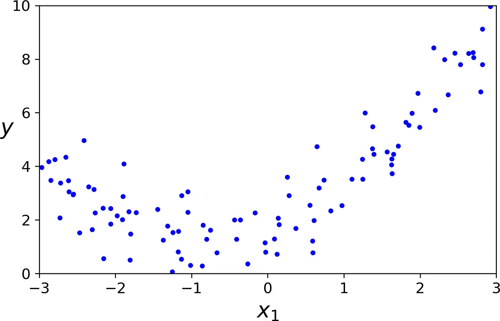
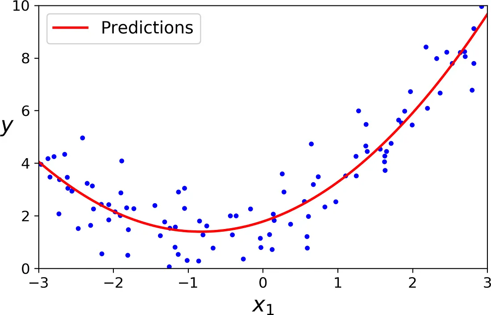
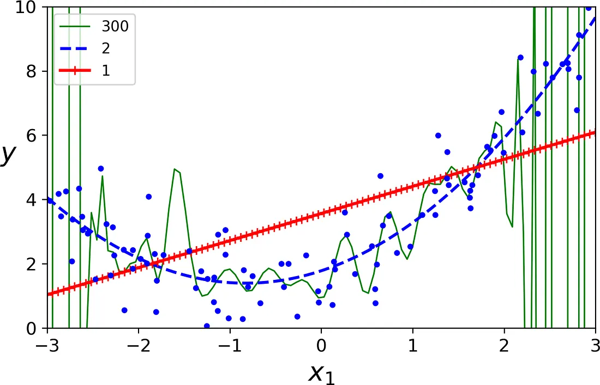
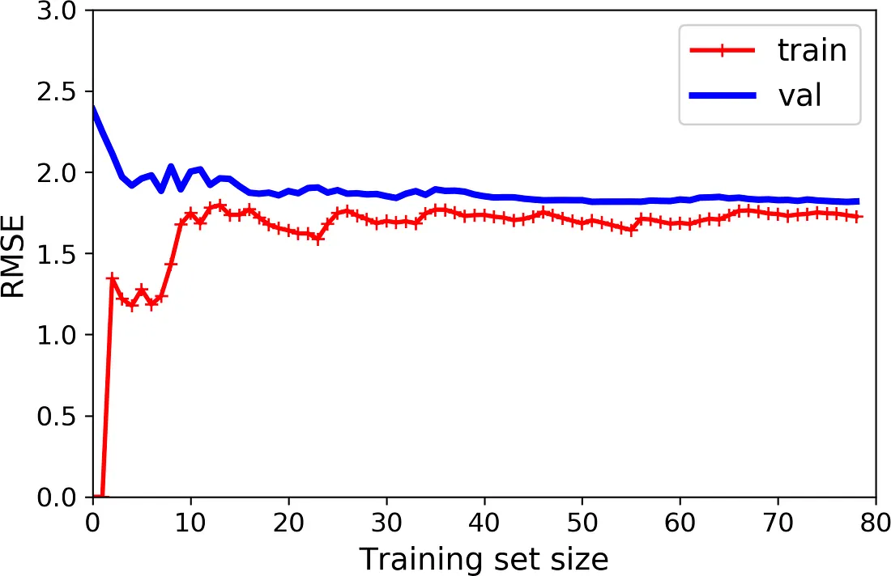
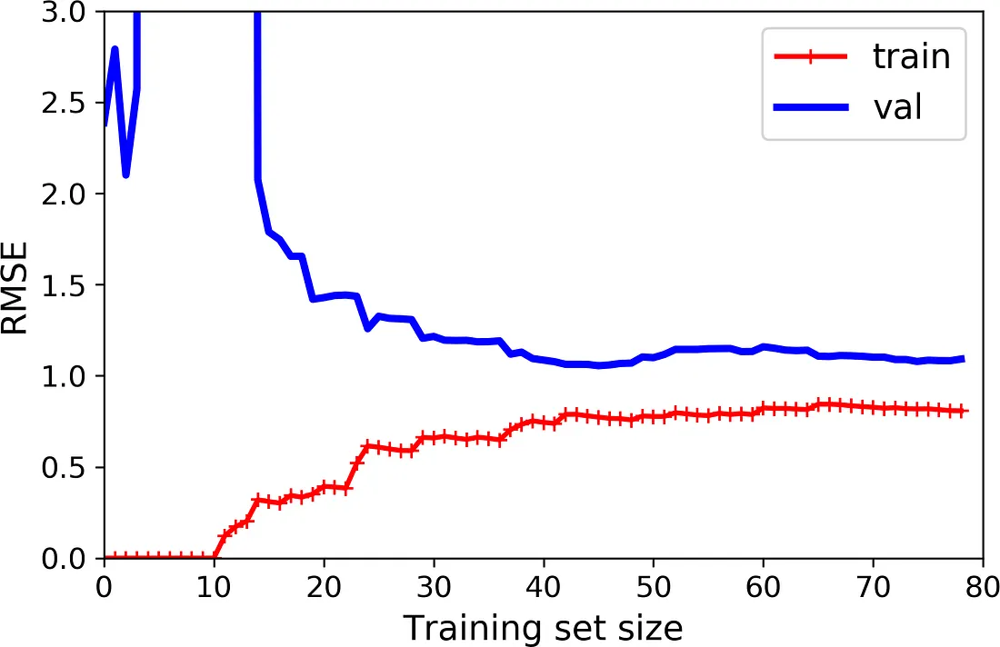

# Polynomial Regression: Fitting Curves With a Straight Line Model

So far, Linear Regression has assumed your data follows a straight line. But real data is rarely that polite. Sometimes it curves, bends, or dips before rising again. The surprising part is that you do not need a brand new algorithm to handle this. You can still use plain Linear Regression, you just need to feed it smarter features. This trick is called Polynomial Regression.

## The Core Idea

The trick is almost embarrassingly simple: take your existing feature, and add its square (or cube, or higher powers) as brand new features. Then hand this expanded set of features to an ordinary Linear Regression model, exactly as before.

Here is some nonlinear data to work with, generated from a quadratic equation with a bit of random noise mixed in.

```python
m = 100
X = 6 * np.random.rand(m, 1) - 3
y = 0.5 * X**2 + X + 2 + np.random.randn(m, 1)
```



*Scatter plot of the raw, curved training data*

Looking at this data, a straight line clearly has no chance of fitting it well. The points curve upward on both ends and dip down in the middle, a shape no straight line can follow.

### Adding the Missing Ingredient: Squared Features

Scikit-Learn's `PolynomialFeatures` class handles the feature expansion for you.

```python
from sklearn.preprocessing import PolynomialFeatures

poly_features = PolynomialFeatures(degree=2, include_bias=False)
X_poly = poly_features.fit_transform(X)
X_poly[0]
```

```
array([-0.75275929, 0.56664654])
```

Notice `X_poly` now holds two values instead of one: the original feature, and that same value squared. Nothing about the underlying data changed, you simply gave the model a second column to work with.

Now a completely ordinary `LinearRegression` can be trained on this expanded feature set, exactly like before.

```python
lin_reg = LinearRegression()
lin_reg.fit(X_poly, y)
```



*The fitted quadratic curve overlaid on the data*

The model ends up estimating `y = 0.56x₁² + 0.93x₁ + 1.78`, remarkably close to the true relationship the data was generated from, `y = 0.5x₁² + 1.0x₁ + 2.0`, plus some unavoidable random noise. Linear Regression, it turns out, was never really restricted to straight lines. It was always just fitting a weighted sum of whatever features you hand it. Give it curved features, and it happily fits a curve.

### What Happens With More Than One Feature

This idea becomes even more interesting once you have multiple original features, since `PolynomialFeatures` does not just square each one individually, it also creates every combination of features up to the chosen degree. With two features, `a` and `b`, and `degree=3`, you would get not just `a²`, `a³`, `b²`, and `b³`, but also cross terms like `ab`, `a²b`, and `ab²`.

### Why Those Cross Terms (like `ab`) Actually Matter

This is the part that deserves slowing down on, since it is easy to read past without really absorbing what it means.

Start with plain Linear Regression using two features, `a` and `b`, with no cross terms at all:

```
y = θ0 + θ1*a + θ2*b
```

In this equation, the effect of `a` on `y` is always exactly `θ1`, a fixed number, completely regardless of what `b` happens to be. Increasing `a` by 1 always changes `y` by the same fixed amount, `θ1`, whether `b` is 0, 100, or a million. The two features are completely independent of each other in how they influence `y`.

But real relationships are often not like that at all. Take a concrete example: imagine predicting how well a houseplant grows, based on `a` = amount of water it gets, and `b` = amount of sunlight it gets. In reality, water and sunlight do not act independently. Watering a plant that is sitting in a dark closet barely helps it grow at all, since there is no sunlight to power photosynthesis. But that exact same amount of water, given to a plant sitting in bright sunlight, might genuinely help it grow a lot. In other words, **the effect of water on growth depends on how much sunlight is also present.** That dependency between the two features is called an interaction, and a plain linear model, `y = θ0 + θ1*a + θ2*b`, has absolutely no way to represent it, since it forces water's effect, `θ1`, to be one single, fixed number no matter what sunlight is doing.

Now add the interaction term, `ab`, into the equation:

```
y = θ0 + θ1*a + θ2*b + θ3*(a*b)
```

To see why this fixes the problem, look at what happens to the effect of `a` on `y` now. Mathematically, that effect is no longer just `θ1`, it becomes `θ1 + θ3*b`. Notice that `b` is now sitting directly inside the expression for how much `a` matters. When `b` is small (little sunlight), the effect of `a` (water) stays close to `θ1` alone, small. When `b` is large (lots of sunlight), the effect of `a` becomes `θ1` plus a meaningfully larger boost from `θ3*b`. The model can now correctly represent "water matters a lot more when there is also plenty of sunlight," which was completely impossible before adding that single `ab` term.

This is exactly what the earlier sentence means by "finding relationships between features." A plain Linear Regression model can only ever say how much each individual feature matters, on its own, in isolation. Adding polynomial cross terms like `ab`, `a²b`, or `ab²` lets the model instead say how much one feature matters, conditional on the value of another feature, capturing exactly the kind of "it depends" relationships that show up constantly in real data.

## How Much Curve Is Too Much Curve?

Since higher degree polynomials can bend and twist more, it is tempting to think higher is always better. It is not. Look at what happens when you compare a straight line (degree 1), the correct quadratic curve (degree 2), and a wildly flexible degree 300 polynomial, all fit to the exact same data.



*Comparing degree 1, degree 2, and degree 300 polynomial fits on the same data*

The degree 300 model contorts itself violently, twisting through nearly every single data point, including the noisy ones. This looks impressive at first glance, since it fits the training data almost perfectly, but it has essentially memorized the noise along with the real pattern. The straight line, on the other hand, barely bends at all and misses the obvious curve in the data entirely. The quadratic model, sitting right in between, captures the actual shape of the data without chasing every noisy wiggle. Since this particular data was generated from a quadratic equation, the quadratic model is exactly the one that will perform best on new, unseen data, even though the degree 300 model looked "better" on the training data itself.

This is your first real look at two ideas that come up constantly in machine learning: an **underfitting** model (the straight line, too simple to capture the real pattern) and an **overfitting** model (the degree 300 curve, so flexible it starts fitting random noise instead of the real signal).

## How Do You Actually Know If You're Overfitting or Underfitting?

In the example above, it was easy to spot underfitting and overfitting, because we already knew the true equation the data came from. In real projects, you never have that luxury. So how do you tell?

### Cross-Validation

One reliable approach is cross-validation. Instead of training your model once on all your data, you split the training set into smaller pieces, called folds, train on most of them, and test on the piece you held back.

### Walking Through K-Fold, Step by Step

The idea is easiest to see with small numbers first. Imagine you have just 10 data points, numbered 1 through 10, and you choose `K=5`. The first step is to randomly split those 10 points into 5 equal groups, called folds, of 2 points each.

```
Fold 1: [point 3, point 7]
Fold 2: [point 1, point 9]
Fold 3: [point 5, point 2]
Fold 4: [point 8, point 4]
Fold 5: [point 6, point 10]
```

Now, instead of training the model just once, you train it 5 separate times, called rounds. In each round, one fold is set aside entirely as the validation set, and the model trains on the remaining 4 folds combined.

```
Round 1: Train on Folds 2, 3, 4, 5   →   Validate on Fold 1
Round 2: Train on Folds 1, 3, 4, 5   →   Validate on Fold 2
Round 3: Train on Folds 1, 2, 4, 5   →   Validate on Fold 3
Round 4: Train on Folds 1, 2, 3, 5   →   Validate on Fold 4
Round 5: Train on Folds 1, 2, 3, 4   →   Validate on Fold 5
```

Notice the key idea: every single fold gets used for validation exactly once, and gets used for training in every other round. By the end of all 5 rounds, every one of your 10 data points has been part of a validation set exactly once, even though no single round ever saw all 10 points at the same time.

Each of these 5 rounds produces its own separate evaluation score (for example, an MSE or an R² score), since each round is really training a slightly different model on a slightly different 4/5 slice of the data. At the end, you have 5 separate scores instead of just 1.

```python
from sklearn.model_selection import cross_val_score

scores = cross_val_score(model, X, y, cv=10, scoring="neg_mean_squared_error")
```

In actual practice, `K=10` is a very common choice, exactly as in the original example, meaning 10 rounds instead of 5, each time training on 9/10 of the data and validating on the remaining 1/10.

### Why Bother With All These Extra Rounds?

Training and testing your model just once, on one particular train/test split, has a real risk: you might get lucky or unlucky with that one particular split. Maybe the random validation set you happened to pick was unusually easy, making your model look better than it really is, or unusually hard, making it look worse. Averaging scores across `K` different splits smooths this randomness out, giving you a far more trustworthy, stable estimate of how well your model is likely to perform on genuinely new data it has never seen.

### Reading the Diagnosis

Once you have your `K` scores, the diagnosis logic from before applies directly. If the model scores well and consistently across training data but noticeably worse across the held-out validation folds, that gap is a sign of overfitting. If it scores poorly across both training and validation folds fairly uniformly, that is a sign of underfitting. A model with high variance (overfitting) tends to also show scores that swing around a lot from fold to fold, since it is sensitive to exactly which specific data points it happened to train on, while a well fitted model tends to produce fairly consistent scores across every fold.

### Learning Curves

A second, very visual approach is plotting learning curves: charts showing how error changes as the size of the training set grows, tracked separately for the training data and a held-out validation set.

### What a Learning Curve Actually Is, Before Any Code

Before looking at the code or the chart, it helps to understand the basic idea in plain words first, with no code at all.

A learning curve answers one question: "as I give my model more and more training data, does it actually get better?" To answer that, you do not train your model just once. You train the exact same model many times over, each time giving it a little more data than the last time, and each time you check two separate scores.

The first score is how well the model does on the exact data it just trained on. This is called the training error. The second score is how well that same model does on a completely separate chunk of data it has never seen during training at all, held aside purely for testing. This is called the validation error.

To make this concrete, imagine you are tracking these two scores by hand as you slowly feed the model more data, and you jot down some made-up numbers as you go.

```
Training points used:   1     5     20    50    80
Training error:         0.0   1.2   1.7   1.8   1.8
Validation error:       3.5   2.3   1.9   1.85  1.82
```

Reading this table tells the whole story before you even need a chart. With just 1 training point, the model can fit that single point perfectly, so training error is 0, but it has learned almost nothing generalizable, so validation error is high, at 3.5. As you feed it more and more points, training error rises a bit, since fitting many points at once perfectly is harder than fitting just one, while validation error falls, since the model is genuinely learning something useful about the real pattern. Eventually, both numbers settle down and stop changing much, plateauing close to each other.

A learning curve is exactly this table, turned into a picture: training set size along the bottom, error going up the side, and two separate lines, one for training error and one for validation error, so you can see this entire story unfold visually instead of squinting at a table of numbers.

Here is the actual code that produces this picture.

```python
from sklearn.metrics import mean_squared_error
from sklearn.model_selection import train_test_split

def plot_learning_curves(model, X, y):
    X_train, X_val, y_train, y_val = train_test_split(X, y, test_size=0.2)
    train_errors, val_errors = [], []
    for m in range(1, len(X_train)):
        model.fit(X_train[:m], y_train[:m])
        y_train_predict = model.predict(X_train[:m])
        y_val_predict = model.predict(X_val)
        train_errors.append(mean_squared_error(y_train[:m], y_train_predict))
        val_errors.append(mean_squared_error(y_val, y_val_predict))
    plt.plot(np.sqrt(train_errors), "r-+", linewidth=2, label="train")
    plt.plot(np.sqrt(val_errors), "b-", linewidth=3, label="val")

lin_reg = LinearRegression()
plot_learning_curves(lin_reg, X, y)
```



*Learning curves for a plain Linear Regression model, showing underfitting*

### Walking Through This Code, One Piece at a Time

Since you said you want no code left unexplained, here is exactly what each part is doing, in plain English, connected directly back to the training-points-vs-error table above.

**The first line inside the function**, `train_test_split(X, y, test_size=0.2)`, does one simple job: it takes your full dataset and splits it into two separate piles right at the start, before anything else happens. 80 percent of the data becomes `X_train, y_train`, the pile the model is allowed to learn from. The remaining 20 percent becomes `X_val, y_val`, the pile that gets locked away and only ever used for testing, never for training. This split happens only once, at the very beginning, and both piles stay fixed for the rest of the function.

**The two empty lists**, `train_errors, val_errors = [], []`, are just empty containers waiting to collect one number per round, exactly like the two rows in the made-up table above waiting to be filled in.

**The loop**, `for m in range(1, len(X_train)):`, is the part that recreates the "train on more and more data" idea. On the very first pass, `m` is 1, so the code trains using only the first 1 training example. On the next pass, `m` is 2, so it retrains using the first 2 examples. This keeps going, `m` growing by 1 each time, all the way up to using every single training example available. Each pass through this loop is one full row of the table above.

**Inside the loop**, `model.fit(X_train[:m], y_train[:m])` retrains the model completely from scratch, using only the first `m` training points, exactly matching whatever `m` currently is. `X_train[:m]` is simply "give me the first `m` rows," nothing fancier than that.

Right after training, two predictions get made. `y_train_predict` asks the freshly trained model to predict on the same `m` points it was just trained on, which is how the training error gets measured. `y_val_predict` asks that same freshly trained model to predict on the validation pile instead, the 20 percent that was locked away earlier and never touched during training, which is how the validation error gets measured. Both predictions come from the exact same model, trained the exact same way, just tested against two different sets of data.

`mean_squared_error(...)` then simply compares each set of predictions against the real, actual values, and returns one number summarizing how far off the model was, on average. That one number gets tacked onto the end of `train_errors` or `val_errors`, using `.append(...)`, which is why, after the loop finishes running completely, both lists end up containing one full error score per training size, precisely mirroring the two rows of the earlier table.

**The last two lines**, after the loop is done, simply draw the picture: `plt.plot(np.sqrt(train_errors), ...)` plots the red training line, and the equivalent line plots the blue validation line. The `np.sqrt(...)` part converts the errors from MSE into RMSE, which just means "undo the squaring," so the resulting numbers are back in the same, easier to interpret units as the original data, exactly as covered in the earlier note on evaluation metrics.

Now compare this to the learning curves of a 10th-degree polynomial model on the exact same data.

```python
from sklearn.pipeline import Pipeline

polynomial_regression = Pipeline([
    ("poly_features", PolynomialFeatures(degree=10, include_bias=False)),
    ("lin_reg", LinearRegression()),
])
plot_learning_curves(polynomial_regression, X, y)
```



*Learning curves for a 10th-degree polynomial model, showing overfitting*

These learning curves look a bit like the previous ones...

Two things stand out compared to the straight line's learning curves. First, the training error is much lower overall, since a 10th-degree polynomial is flexible enough to fit the training data far more closely. Second, and more importantly, there is now a visible gap between the two curves: the model performs noticeably better on training data than on validation data. That gap is the hallmark of overfitting. Encouragingly, if you kept adding more training data, that gap would gradually shrink, since it becomes harder for even a flexible model to memorize noise once there is simply too much varied data to memorize.

## The Bias-Variance Tradeoff, Explained Slowly

This is one of the most important ideas in all of machine learning, so it is worth slowing down and building it up properly, piece by piece, rather than rushing through it.

### Starting With a Simple Analogy

Imagine you are learning to throw darts at a dartboard, and your goal is to always hit the exact bullseye.

Imagine one thrower whose darts always land in a tight little cluster together, but that cluster is sitting way off to the upper left of the board, nowhere near the bullseye. Every throw is consistent, but consistently wrong. This thrower has **high bias**: a systematic, repeated error, caused by a flawed technique that never actually points toward the true target.

Now imagine a second thrower whose darts scatter wildly all over the board, sometimes near the bullseye, sometimes far in a completely different corner, with no consistency at all. On average, across many throws, these darts might actually center around the true bullseye, but any single throw is wildly unpredictable. This thrower has **high variance**: no systematic error, but wild inconsistency from one attempt to the next.

A great model is like a third thrower whose darts land in a tight cluster right around the bullseye itself: consistent, and consistently correct. That is low bias and low variance together, and it is exactly what every machine learning model is trying to achieve.

### Translating This Back to Machine Learning

A model's total error on new, unseen data (called its generalization error) can be broken down into exactly three separate pieces.

**Bias** is error caused by wrong assumptions baked into the model itself, like assuming a relationship is a straight line when it is actually curved. This is exactly the straight-line model from earlier in this note: no matter how much data you give it, it will always underestimate the curve in the data, since its fundamental assumption, "this is linear," is simply wrong. A model with high bias tends to underfit.

**Variance** is error caused by the model being overly sensitive to the specific quirks of whatever training data it happened to see. A model with many degrees of freedom, like the degree 300 polynomial from earlier, has high variance: give it a slightly different training set, drawn from the same underlying data, and it might produce a wildly different-looking curve each time, since it is chasing the specific noise in each particular sample rather than the real underlying pattern. A model with high variance tends to overfit.

**Irreducible error** is the piece nobody can fix by choosing a better model. It comes from genuine randomness or noise baked into the data itself, things like measurement error, broken sensors, or simply real-world unpredictability. The only way to reduce this part is to improve the data itself, by fixing data collection problems or removing clear outliers, not by tweaking the model.

### Why It's Called a Tradeoff

Here is the part that makes this genuinely tricky rather than just a vocabulary lesson: bias and variance pull against each other.

Make a model simpler (fewer polynomial degrees, fewer features, stronger assumptions), and you reduce its variance, since it becomes less sensitive to the specific noise in any one training set, but you increase its bias, since a simpler model has less flexibility to capture the true underlying pattern.

Make a model more complex (more polynomial degrees, more features, fewer restrictive assumptions), and you reduce its bias, since it becomes flexible enough to capture more intricate patterns, but you increase its variance, since that same flexibility now lets it latch onto noise and quirks specific to whatever training data it happened to see.

You cannot independently push both bias and variance down at the same time just by adjusting model complexity. Reducing one, through this particular lever, tends to increase the other. The entire goal of model selection is finding the sweet spot in the middle, complex enough to avoid high bias and underfitting, but restrained enough to avoid high variance and overfitting, exactly the spot the quadratic model occupied in the degree comparison chart earlier in this note, sitting comfortably between the underfitting straight line and the overfitting degree 300 curve.

### A Quick Mental Checklist

If your model's error is high on both the training data and new data, and the two are close together, you likely have a high bias problem, meaning the model is too simple. If your model's error is low on training data but noticeably higher on new data, you likely have a high variance problem, meaning the model is too complex or too sensitive to the specific training set it saw.

## Fixing Underfitting

If your model is underfitting, meaning it shows high bias, a few concrete options can help.

Increase the model's complexity, for instance by raising the polynomial degree.

Add more features, or engineer better ones that more directly capture the pattern in the data.

Remove noise from the data itself, if some of it is due to genuinely bad data quality rather than real signal.

Increase the number of training epochs or the overall training time, giving the model more opportunity to fit the pattern that is actually there.

Notice what is missing from this list: simply adding more training data does not fix underfitting, exactly as the earlier learning curve for the straight-line model demonstrated. A model that is fundamentally too simple to capture a pattern will stay too simple no matter how much data it sees.

Fixing the opposite problem, overfitting, involves a different set of tools entirely, mainly centered around regularization techniques that deliberately restrain an overly flexible model, and is worth its own dedicated note.

